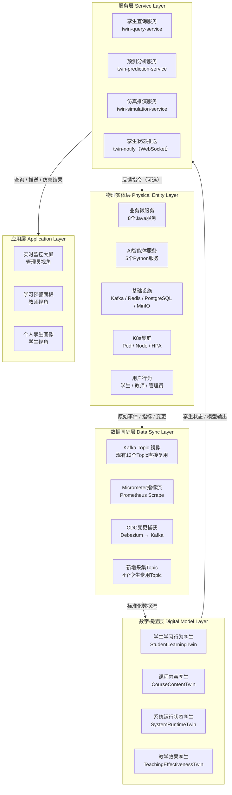
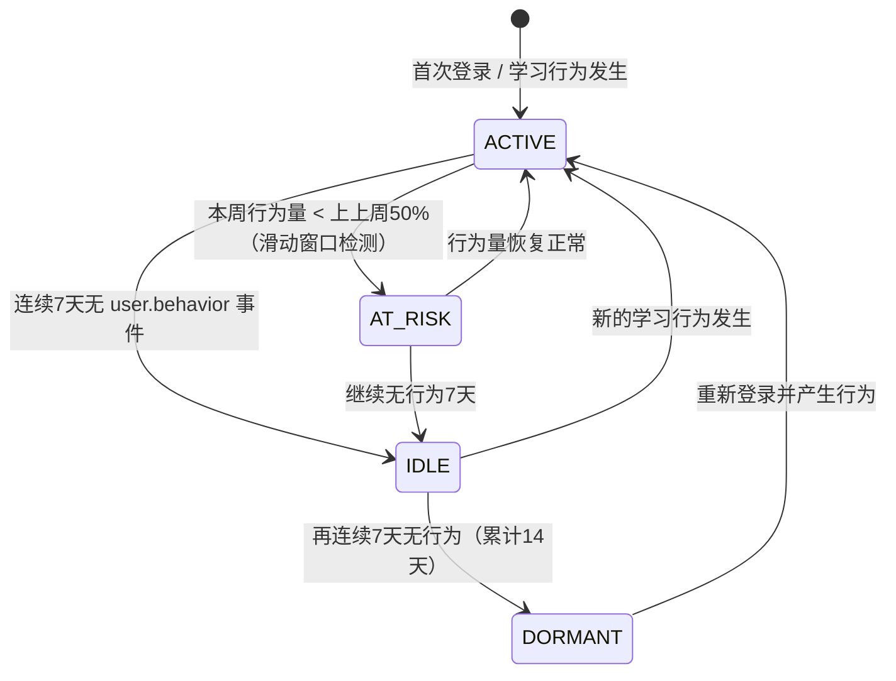
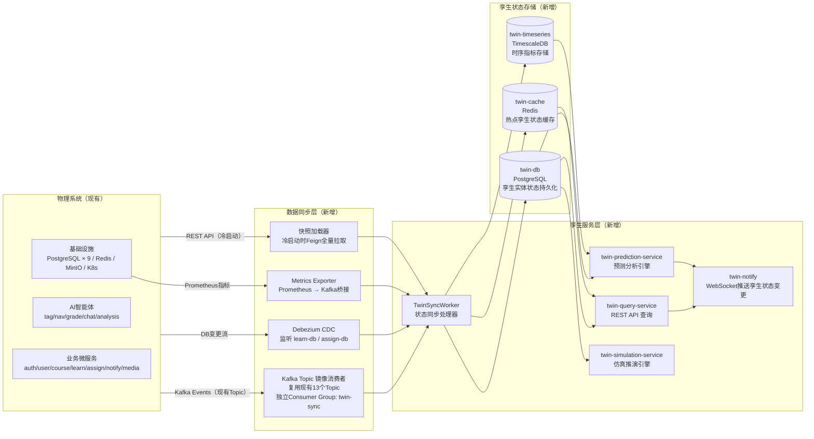
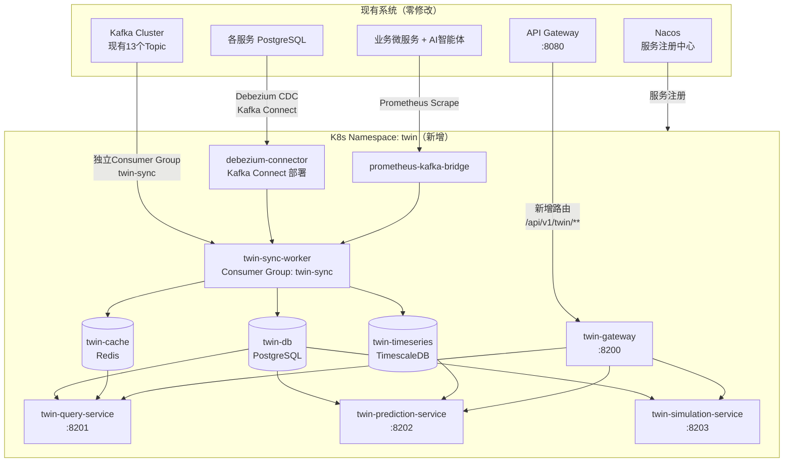
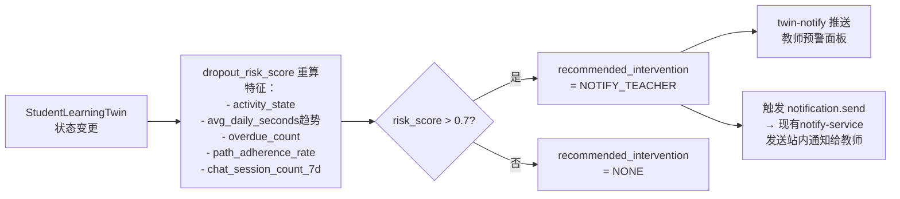
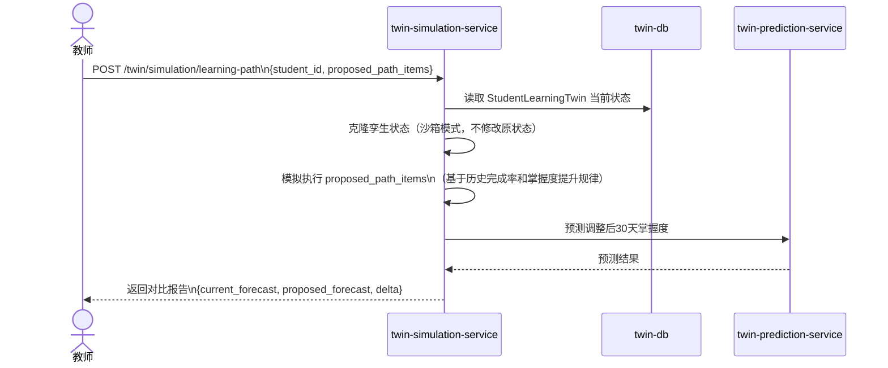
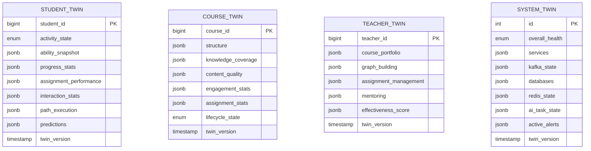

# CloudTeachingAI 数字孪生设计文档（DT）

**文档版本**：v1.0
**创建日期**：2026-03-21
**关联文档**：SDD-CloudTeachingAI.md v2.4

---

## 1. 数字孪生架构设计

### 1.1 四层架构总览



### 1.2 与现有系统的关系定位

数字孪生层作为**只读观测层**叠加在现有系统之上，不修改任何现有服务的业务逻辑。

| 原则 | 说明 |
|------|------|
| 零侵入 | 现有13个Kafka Topic直接复用，不修改生产者代码 |
| 只读订阅 | 孪生层只消费数据，不向业务服务写入 |
| 独立部署 | 孪生服务作为新的K8s Namespace `twin` 独立运行 |
| 最终一致 | 孪生模型状态与物理实体保持最终一致，允许秒级延迟 |

---

## 2. 核心孪生实体建模

### 2.1 学生学习行为孪生（StudentLearningTwin）

**物理映射**：learn-service + assign-service + chat-agent 中的单个学生

**状态属性定义**：

```
StudentLearningTwin {
    student_id: bigint                    // 来源：user-db.USER.id
    twin_version: timestamp               // 最后同步时间

    activity_state: enum {
        ACTIVE,          // 近7天有学习行为
        IDLE,            // 7-14天无行为
        DORMANT,         // 14天以上无行为
        AT_RISK          // 活跃度骤降（较前2周下降>50%）
    }

    ability_snapshot: [{
        knowledge_point_id: int
        mastery: enum { NONE, PARTIAL, MASTERED }
        score: float
        last_updated: timestamp
    }]                                    // 来源：learn-db.ABILITY_MAP

    progress_stats: {
        total_resources: int
        completed_resources: int
        completion_rate: float
        total_watch_seconds: int
        avg_daily_seconds: float          // 近7天日均学习时长
    }                                     // 来源：learn-db.LEARNING_PROGRESS

    assignment_performance: {
        submitted_count: int
        avg_ai_score: float
        avg_final_score: float
        pending_count: int
        overdue_count: int
    }                                     // 来源：assign-db.SUBMISSION

    interaction_stats: {
        chat_session_count_7d: int
        avg_tokens_per_session: float
        last_chat_at: timestamp
    }                                     // 来源：chat-db.CHAT_SESSION

    path_execution: {
        current_path_generated_at: timestamp
        path_items_total: int
        path_items_completed: int
        path_adherence_rate: float        // 路线遵循率
    }                                     // 来源：learn-db.LEARNING_PATH

    predictions: {
        dropout_risk_score: float         // 流失风险分 0-1
        mastery_forecast_30d: [{
            knowledge_point_id: int
            predicted_mastery: enum
        }]
        recommended_intervention: enum {
            NONE, NOTIFY_TEACHER, TRIGGER_NAV_REFRESH, SEND_ENCOURAGEMENT
        }
    }
}
```

**状态转换规则**：



---

### 2.2 课程内容孪生（CourseContentTwin）

**物理映射**：course-service + tag-agent + vector-db 中的单门课程

**状态属性定义**：

```
CourseContentTwin {
    course_id: bigint
    twin_version: timestamp

    structure: {
        chapter_count: int
        resource_count: int
        resource_type_distribution: { VIDEO: int, DOCUMENT: int, SLIDE: int }
        total_duration_seconds: int
    }                                     // 来源：course-db.CHAPTER / RESOURCE

    knowledge_coverage: [{
        knowledge_point_id: int
        knowledge_point_name: varchar
        resource_count: int
        avg_confidence: float
        confirmed_count: int
        unconfirmed_count: int
    }]                                    // 来源：course-db.RESOURCE_KNOWLEDGE

    content_quality: {
        tagging_completeness: float       // 已标注资源占比
        teacher_confirmation_rate: float
        title_only_tag_rate: float        // 降级标注（TITLE_ONLY）占比
        compliance_flag_count: int
        compliance_flag_pending: int
    }                                     // 来源：analysis-db.COMPLIANCE_FLAG

    engagement_stats: {
        enrolled_student_count: int
        active_learner_count_7d: int
        avg_completion_rate: float
        most_accessed_resource_id: bigint
        least_accessed_resource_id: bigint
        avg_watch_rate: float
    }                                     // 来源：learn-db.LEARNING_PROGRESS 聚合

    assignment_stats: {
        assignment_count: int
        avg_class_score: float
        score_distribution: [{ range: string, count: int }]
        ai_grading_success_rate: float
    }                                     // 来源：assign-db.SUBMISSION 聚合

    lifecycle_state: enum {
        DRAFT,           // 草稿，无学生
        ACTIVE,          // 正常运行中
        LOW_ENGAGEMENT,  // 活跃学习者 < 20%
        CONTENT_ISSUE,   // 合规预警未处置
        ARCHIVED
    }
}
```

---

### 2.3 系统运行状态孪生（SystemRuntimeTwin）

**物理映射**：整个K8s集群 + 所有微服务 + 基础设施

**状态属性定义**：

```
SystemRuntimeTwin {
    twin_version: timestamp
    overall_health: enum { HEALTHY, DEGRADED, CRITICAL }

    services: [{
        service_name: string
        namespace: enum { biz, ai, infra }
        replicas_ready: int
        replicas_desired: int
        cpu_usage_pct: float
        memory_usage_pct: float
        p99_latency_ms: float
        error_rate_pct: float
        hpa_triggered: boolean
        health: enum { HEALTHY, DEGRADED, DOWN }
    }]                                    // 来源：Prometheus Micrometer 指标

    kafka_state: [{
        topic: string
        consumer_group: string
        lag: bigint
        lag_seconds: float
        producer_rate: float
        consumer_rate: float
    }]                                    // 来源：Kafka JMX / Kafka UI API

    databases: [{
        db_name: string
        primary_healthy: boolean
        replica_lag_seconds: float
        active_connections: int
        slow_query_count_1h: int
        disk_usage_pct: float
    }]                                    // 来源：PostgreSQL pg_stat_* + Prometheus

    redis_state: {
        cluster_ok: boolean
        used_memory_pct: float
        hit_rate: float
        evicted_keys_1h: int
        connected_clients: int
    }

    ai_task_state: [{
        agent: string
        queue_depth: int
        avg_processing_time_ms: float
        claude_api_error_rate: float
        fallback_triggered_count_1h: int
    }]

    active_alerts: [{
        alert_name: string
        severity: enum { P1, P2 }
        triggered_at: timestamp
        service: string
    }]
}
```

---

### 2.4 教学效果孪生（TeachingEffectivenessTwin）

**物理映射**：teacher_id 维度的教学行为聚合

**状态属性定义**：

```
TeachingEffectivenessTwin {
    teacher_id: bigint
    twin_version: timestamp

    course_portfolio: [{
        course_id: bigint
        title: varchar
        enrolled_count: int
        avg_completion_rate: float
        avg_score: float
        content_quality_score: float
    }]

    graph_building: {
        total_resources: int
        tagged_resources: int
        confirmed_tags: int
        pending_confirmation: int
        knowledge_points_covered: int
        graph_density: float              // 资源/知识点比
    }

    assignment_management: {
        total_assignments: int
        avg_submission_rate: float
        avg_class_score: float
        manual_review_rate: float
        avg_review_turnaround_hours: float
    }

    mentoring: {
        active_mentee_count: int
        at_risk_mentee_count: int         // 处于AT_RISK状态的学生数
        guidance_frequency_30d: float
        last_guidance_at: timestamp
    }

    effectiveness_score: {
        content_quality: float            // 0-100
        student_engagement: float
        learning_outcome: float
        responsiveness: float
        composite_score: float
    }
}
```

---

## 3. 数据采集点规划

### 3.1 现有 Kafka Topic 复用（零改造）

| 现有 Topic | 孪生用途 | 目标孪生实体 |
|-----------|---------|------------|
| `user.behavior` | 更新活跃度、进度统计 | StudentLearningTwin |
| `ability.updated` | 触发能力快照同步、流失风险重算 | StudentLearningTwin |
| `learning-path.generated` | 更新路线执行状态 | StudentLearningTwin |
| `submission.created` | 更新作业待批改队列深度 | StudentLearningTwin, TeachingEffectivenessTwin |
| `submission.graded` | 更新作业得分统计 | StudentLearningTwin, CourseContentTwin |
| `submission.reviewed` | 更新人工复核率指标 | TeachingEffectivenessTwin |
| `resource.uploaded` | 触发课程结构快照更新 | CourseContentTwin |
| `resource.tagged` | 更新知识图谱覆盖状态 | CourseContentTwin |
| `login.event` | 更新活跃度状态、AT_RISK检测 | StudentLearningTwin |
| `notification.send` | 统计通知频率（间接反映系统事件密度） | SystemRuntimeTwin |

### 3.2 新增孪生专用采集 Topic

现有 Topic 覆盖了业务事件，以下维度存在采集盲区，需新增：

**`twin.metrics.service`**

```
生产者：各微服务 Micrometer（通过 Prometheus Remote Write 桥接）
消费者：SystemRuntimeTwin 同步器
采集内容：service_name, instance_id, cpu_usage_pct, memory_usage_pct,
          http_request_count, http_error_count, p99_latency_ms, hpa_current_replicas
采集频率：30秒一次
```

**`twin.metrics.kafka`**

```
生产者：Kafka Exporter（独立采集进程，读取 Kafka JMX）
消费者：SystemRuntimeTwin 同步器
采集内容：topic, consumer_group, lag, producer_rate, consumer_rate
采集频率：15秒一次
```

**`twin.cdc.learn`**

```
生产者：Debezium CDC（监听 learn-db.LEARNING_PROGRESS 表）
消费者：StudentLearningTwin 同步器
用途：实时捕获学习进度变化，补充 user.behavior 事件中缺失的进度细节
```

**`twin.cdc.assign`**

```
生产者：Debezium CDC（监听 assign-db.SUBMISSION 表）
消费者：StudentLearningTwin / CourseContentTwin 同步器
用途：实时追踪作业批改状态机转换，补充 submission.graded 之外的中间状态
```

### 3.3 冷启动全量快照拉取

孪生服务初始化时，通过 Feign 调用现有 API 进行全量快照拉取，后续通过 Kafka 增量更新：

| 采集目标 | 调用端点 | 用途 |
|---------|---------|------|
| 学生能力图谱全量 | `GET /api/v1/students/{id}/ability-map` | StudentLearningTwin 冷启动 |
| 课程结构全量 | `GET /api/v1/courses/{id}/chapters` | CourseContentTwin 冷启动 |
| 作业提交统计 | `GET /api/v1/assignments/{id}/submissions` | 历史数据回填 |
| 分析报告 | `GET /api/v1/analysis/reports` | TeachingEffectivenessTwin 初始化 |

---

## 4. 数据流向设计

### 4.1 整体数据流



### 4.2 TwinSyncWorker 事件路由规则

| 事件 Topic | 触发动作 | 目标孪生实体 |
|-----------|---------|------------|
| `login.event` | activity_state 重算 | StudentLearningTwin |
| `user.behavior` | progress_stats 增量更新 | StudentLearningTwin |
| `ability.updated` | ability_snapshot 全量刷新 + dropout_risk_score 重算 | StudentLearningTwin |
| `learning-path.generated` | path_execution 更新 | StudentLearningTwin |
| `submission.created` | assignment_performance.pending_count +1 | StudentLearningTwin, CourseContentTwin |
| `submission.graded` | assignment_performance 更新 + avg_class_score 重算 | StudentLearningTwin, CourseContentTwin, TeachingEffectivenessTwin |
| `submission.reviewed` | manual_review_rate 更新 | TeachingEffectivenessTwin |
| `resource.tagged` | knowledge_coverage 更新 + content_quality 重算 | CourseContentTwin |
| `twin.metrics.service` | services[*] 更新 | SystemRuntimeTwin |
| `twin.metrics.kafka` | kafka_state[*] 更新 | SystemRuntimeTwin |
| `twin.cdc.learn` | progress_stats 细粒度更新 | StudentLearningTwin |
| `twin.cdc.assign` | 状态机同步 | StudentLearningTwin, CourseContentTwin |

---

## 5. 与现有系统的集成方案

### 5.1 集成架构（最小侵入性）



### 5.2 对现有系统的唯一改动

只需在 API Gateway 路由配置中追加一条规则：

```yaml
- id: twin-query-service
  uri: lb://twin-query-service
  predicates: [Path=/api/v1/twin/**]
  filters: [JwtAuthFilter, RoleFilter=ADMIN|TEACHER, StripPrefix=0]
```

Debezium 通过 Kafka Connect 独立部署，以 PostgreSQL 逻辑复制槽（Logical Replication Slot）方式读取 WAL 日志，不需要修改任何现有服务代码。

### 5.3 孪生服务 API 端点

**twin-query-service**

```
GET  /api/v1/twin/students/{id}                  # 学生孪生画像
GET  /api/v1/twin/students/{id}/risk             # 流失风险详情
GET  /api/v1/twin/courses/{id}                   # 课程孪生状态
GET  /api/v1/twin/teachers/{id}                  # 教学效果孪生
GET  /api/v1/twin/system                         # 系统运行状态孪生
GET  /api/v1/twin/system/alerts                  # 当前活跃告警
WS   /ws/twin/updates                            # 孪生状态变更推送
```

**twin-prediction-service**

```
GET  /api/v1/twin/students/{id}/forecast         # 30天掌握度预测
GET  /api/v1/twin/courses/{id}/engagement-trend  # 课程参与度趋势预测
POST /api/v1/twin/simulation/learning-path       # 仿真：调整路线后的效果预测
```

---

## 6. 孪生应用场景

### 6.1 预测性分析

**场景 A：学生流失风险预测**



**场景 B：知识点掌握度预测**

基于 `ability_snapshot` 历史时序数据（存储在 TwinTS），对每个知识点拟合学习曲线，预测30天后的掌握状态，输出到 `StudentLearningTwin.predictions.mastery_forecast_30d`，供 nav-agent 在路线生成时参考。

**场景 C：课程内容质量预警**

当 `CourseContentTwin.content_quality.title_only_tag_rate > 0.3`（超过30%资源为降级标注）时，自动生成内容质量预警，推送给对应教师。

---

### 6.2 实时监控

**系统运行监控大屏**（管理员视角，扩展现有 `/admin/stats`）：

| 面板区域 | 数据来源 | 刷新方式 |
|---------|---------|---------|
| 服务健康矩阵（13个服务 × 副本数/CPU/内存/错误率） | SystemRuntimeTwin.services | WebSocket推送，≤5s |
| Kafka消费延迟趋势 | SystemRuntimeTwin.kafka_state | WebSocket推送，≤5s |
| 实时在线学习人数 / AI任务队列深度 | StudentLearningTwin聚合 | WebSocket推送，≤5s |
| AT_RISK学生数 / 合规预警未处置数 / P1告警 | StudentLearningTwin + CourseContentTwin | WebSocket推送，≤5s |

**教师学生预警面板**（扩展现有 `/teacher/students`）：

| 预警类型 | 触发条件 | 展示信息 |
|---------|---------|---------|
| 流失风险 | dropout_risk_score > 0.7 | 学生姓名、风险分、最后活跃时间、建议干预方式 |
| 作业逾期 | overdue_count > 0 | 逾期作业数、最近逾期作业名称 |
| 能力停滞 | 连续14天 ability_snapshot 无变化 | 停滞知识点列表 |
| 路线偏离 | path_adherence_rate < 0.3 | 推荐路线与实际学习路径的偏差 |

---

### 6.3 仿真推演

**场景：调整学习路线后的效果仿真**



仿真结果仅作为辅助参考，不自动修改物理系统中的学习路线。

---

## 7. 孪生数据库设计

### 7.1 twin-db 核心表结构



### 7.2 twin-timeseries 时序表结构（TimescaleDB）

```sql
-- 学生活跃度时序
CREATE TABLE student_activity_ts (
    time        TIMESTAMPTZ NOT NULL,
    student_id  BIGINT NOT NULL,
    metric      VARCHAR(64),  -- 'daily_seconds', 'completion_rate', 'dropout_risk_score'
    value       FLOAT
);
SELECT create_hypertable('student_activity_ts', 'time');

-- 系统指标时序
CREATE TABLE system_metrics_ts (
    time         TIMESTAMPTZ NOT NULL,
    service_name VARCHAR(64),
    metric       VARCHAR(64),  -- 'cpu_pct', 'p99_latency_ms', 'error_rate_pct'
    value        FLOAT
);
SELECT create_hypertable('system_metrics_ts', 'time');
```

---

## 8. 部署规划

### 8.1 新增 K8s 资源清单

```yaml
# Namespace: twin
services:
  twin-sync-worker:        # Kafka消费 + CDC处理，端口 8300
  twin-query-service:      # REST查询API，端口 8201
  twin-prediction-service: # 预测分析，端口 8202
  twin-simulation-service: # 仿真推演，端口 8203
  twin-notify:             # WebSocket推送，端口 8204
  debezium-connect:        # Kafka Connect + Debezium，端口 8083
  prometheus-kafka-bridge: # 指标桥接，端口 8084

databases:
  twin-db:                 # PostgreSQL，端口 5432
  twin-cache:              # Redis，端口 6379
  twin-timeseries:         # TimescaleDB，端口 5433
```

### 8.2 HPA 配置

| 服务 | 初始副本 | 最大副本 | 触发条件 |
|------|---------|---------|---------|
| twin-sync-worker | 2 | 6 | Kafka `twin.*` Topic 消费延迟 > 30s |
| twin-query-service | 2 | 4 | CPU > 70% |
| twin-prediction-service | 1 | 3 | CPU > 70% |
| twin-simulation-service | 1 | 2 | 按需手动扩容 |
| twin-notify | 2 | 4 | 连接数 > 200/副本 |

---

## 9. 孪生服务代码结构

### 9.1 twin-sync-worker（Python）

```
twin-sync-worker/
├── main.py                         # 启动入口，初始化消费者和快照加载器
├── consumer/
│   ├── kafka_consumer.py           # aiokafka 消费现有13个Topic + 4个孪生Topic
│   └── event_router.py             # 事件路由：Topic → 对应孪生实体更新器
├── updater/
│   ├── student_twin_updater.py     # StudentLearningTwin 状态更新逻辑
│   ├── course_twin_updater.py      # CourseContentTwin 状态更新逻辑
│   ├── teacher_twin_updater.py     # TeachingEffectivenessTwin 状态更新逻辑
│   └── system_twin_updater.py      # SystemRuntimeTwin 状态更新逻辑
├── snapshot/
│   └── snapshot_loader.py          # 冷启动全量快照拉取（Feign调用现有API）
├── db/
│   ├── twin_db.py                  # twin-db asyncpg 连接池
│   ├── twin_cache.py               # twin-cache Redis 连接
│   └── twin_ts.py                  # twin-timeseries asyncpg 连接池
├── config.py
├── requirements.txt
└── Dockerfile
```

### 9.2 twin-query-service（Python FastAPI）

```
twin-query-service/
├── main.py
├── router/
│   ├── student_router.py           # GET /twin/students/{id}
│   ├── course_router.py            # GET /twin/courses/{id}
│   ├── teacher_router.py           # GET /twin/teachers/{id}
│   └── system_router.py            # GET /twin/system
├── websocket/
│   └── twin_ws_handler.py          # WS /ws/twin/updates 推送孪生状态变更
├── db/
│   └── twin_db.py
├── config.py
└── Dockerfile
```

### 9.3 twin-prediction-service（Python FastAPI）

```
twin-prediction-service/
├── main.py
├── router/
│   ├── forecast_router.py          # GET /twin/students/{id}/forecast
│   └── simulation_router.py        # POST /twin/simulation/learning-path
├── model/
│   ├── dropout_risk_model.py       # 流失风险评分模型（特征工程 + 规则/ML）
│   ├── mastery_forecast_model.py   # 掌握度预测（学习曲线拟合）
│   └── simulation_engine.py        # 路线调整效果仿真引擎
├── db/
│   ├── twin_db.py
│   └── twin_ts.py
├── config.py
└── Dockerfile
```

---

## 10. Nacos 配置规划

```
# 孪生服务公共配置
twin-common-config.yaml
  - kafka.bootstrap-servers: kafka:9092
  - kafka.consumer-group: twin-sync
  - twin-db.url: postgresql://twin-db:5432/twin
  - twin-cache.nodes: twin-cache:6379
  - twin-timeseries.url: postgresql://twin-timeseries:5433/twin_ts

# 各孪生服务独立配置
twin-sync-worker-prod.yaml
  - snapshot.batch-size: 100
  - snapshot.concurrency: 4

twin-prediction-service-prod.yaml
  - dropout-risk.threshold: 0.7
  - forecast.horizon-days: 30

twin-query-service-prod.yaml
  - cache.ttl-seconds: 30
```

---

## 11. 关键设计决策

| 决策点 | 选择 | 理由 |
|--------|------|------|
| 孪生状态存储格式 | jsonb（PostgreSQL） | 各孪生实体结构差异大，jsonb 灵活且支持索引查询 |
| 时序存储 | TimescaleDB | 基于 PostgreSQL 扩展，运维成本低，支持时序压缩和连续聚合 |
| CDC 工具 | Debezium + Kafka Connect | 与现有 Kafka 基础设施复用，零侵入业务服务 |
| 孪生层与业务层隔离 | 独立 K8s Namespace + 独立数据库 | 孪生层故障不影响业务系统，资源独立管控 |
| 预测模型 | 规则引擎 + 简单统计模型 | 初期数据量有限，避免过度工程化；后期可替换为 ML 模型 |
| 仿真模式 | 沙箱克隆（只读） | 仿真不修改物理系统状态，保证数据安全 |

---

*物理系统设计详见 SDD-CloudTeachingAI.md v2.4*

