# CloudTeachingAI 系统设计文档（SDD）

**文档版本**：v2.1
**创建日期**：2026-03-20
**最后更新**：2026-03-21
**关联文档**：URD-CloudTeachingAI.md v2.4 / FRD-CloudTeachingAI.md v1.2 / NFR-CloudTeachingAI.md v1.1

> v2.0 重大变更：后端由"单体 API + 独立 AI 服务"重构为微服务分布式架构，引入 API 网关、服务注册中心、消息总线，数据层按服务边界拆分，各服务独立部署和扩展。
>
> v2.1 修订：补充 chat-db 和 analysis-db 的 ER 图及 Nacos 配置；在 Kafka Topic 规划中补充冗余字段同步事件（`knowledge-point.updated`、`resource.updated`、`course.updated`）；在 learn-db ER 图中补充 `QUESTION` 表；在 API Gateway 路由中补充 WebSocket 鉴权方案和 analysis-agent 路由；明确 media-service 上传状态的 Redis 存储限制；补充 analysis-agent 输出存储方案及管理员 API 端点；优化 media-service 和 chat-agent 的 HPA 触发指标；补充 analysis-agent 代码目录结构。

---

## 1. 系统架构概览

### 1.1 整体架构

系统采用微服务分布式架构，共分为五层：客户端层、接入层、微服务层、消息层、数据层。

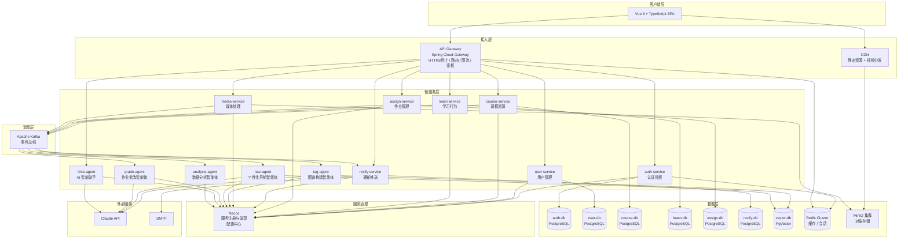

### 1.2 架构分层说明

| 层次 | 组件 | 职责 |
|------|------|------|
| 客户端层 | Vue 3 SPA | 渲染、路由、状态管理，统一通过 API Gateway 访问后端 |
| 接入层 | API Gateway + CDN | 统一入口：HTTPS 终止、JWT 预校验、路由转发、全局限流；CDN 分发静态资源和视频 |
| 服务治理 | Nacos | 服务注册与发现、健康检查、分布式配置中心 |
| 微服务层 | 8 个业务服务 + 5 个 AI 智能体服务 | 各服务职责单一，独立部署，通过 Kafka 事件总线异步协作 |
| 消息层 | Apache Kafka | 服务间异步解耦，保证事件可靠投递，支持重放 |
| 数据层 | 各服务独立数据库 + 共享 Redis + MinIO | 数据按服务边界隔离，禁止跨服务直接访问数据库 |

### 1.3 微服务职责划分

| 服务 | 端口 | 核心职责 | 独立数据库 |
|------|------|---------|-----------|
| auth-service | 8001 | 登录、JWT 签发与刷新、密码重置 | auth-db |
| user-service | 8002 | 用户账号 CRUD、角色管理、导师关系 | user-db |
| course-service | 8003 | 课程/章节/资源管理、知识点分类体系 | course-db |
| learn-service | 8004 | 学习进度、能力图谱测试、个性化路线展示 | learn-db |
| assign-service | 8005 | 作业布置、提交、批改结果存储 | assign-db |
| notify-service | 8006 | 站内通知、WebSocket 推送、邮件发送 | notify-db |
| media-service | 8007 | 文件上传（tus）、视频转码任务调度、预签名 URL | — |
| tag-agent | 8101 | 图谱构建和映射智能体（AI） | vector-db |
| nav-agent | 8102 | 个性化导航智能体（AI） | vector-db |
| grade-agent | 8103 | 作业批改智能体（AI） | — |
| chat-agent | 8104 | AI 智能助手答疑（同步 SSE） | chat-db |
| analysis-agent | 8105 | 数据分析智能体（AI） | analysis-db |


---

## 2. 技术选型

### 2.1 前端

| 技术 | 版本 | 用途 |
|------|------|------|
| Vue 3 | 3.4+ | 核心框架，Composition API |
| TypeScript | 5.x | 类型安全 |
| Vite | 5.x | 构建工具 |
| Pinia | 2.x | 状态管理 |
| Vue Router | 4.x | 客户端路由 |
| Axios | 1.x | HTTP 客户端，封装拦截器 |
| Element Plus | 2.x | UI 组件库 |
| ECharts | 5.x | 能力图谱可视化 |
| Video.js | 8.x | 视频播放器，支持 HLS |
| tus-js-client | 4.x | 断点续传协议客户端 |

### 2.2 接入层

| 技术 | 版本 | 用途 |
|------|------|------|
| Spring Cloud Gateway | 4.x | API 网关：路由、限流、JWT 预校验、跨域 |
| Nacos | 2.3+ | 服务注册与发现、分布式配置中心 |

### 2.3 业务微服务（Java 技术栈）

| 技术 | 版本 | 用途 |
|------|------|------|
| Java | 21 LTS | 运行时 |
| Spring Boot | 3.3+ | 微服务框架 |
| Spring Cloud | 2023.x | 微服务套件（OpenFeign、LoadBalancer） |
| Spring Security | 6.x | 服务级权限校验 |
| Spring Data JPA | — | ORM |
| jjwt | 0.12+ | JWT 解析（各服务验签） |
| Flyway | — | 各服务数据库版本迁移 |
| Micrometer + Prometheus | — | 指标采集 |

### 2.4 AI 智能体服务（Python 技术栈）

| 技术 | 版本 | 用途 |
|------|------|------|
| Python | 3.12 | 运行时 |
| FastAPI | 0.111+ | 异步 Web 框架 |
| Anthropic SDK | latest | 调用 Claude API（claude-sonnet-4-6） |
| aiokafka | — | 异步 Kafka 消费者 |
| pgvector + asyncpg | — | 向量数据库异步访问 |
| PyMuPDF / python-pptx | — | 文档内容解析 |

### 2.5 消息层

| 技术 | 版本 | 用途 |
|------|------|------|
| Apache Kafka | 3.7+ | 服务间事件总线，异步解耦 |
| Kafka UI | — | 开发/运维可视化管理 |

### 2.6 数据层

| 技术 | 用途 |
|------|------|
| PostgreSQL 16 | 各业务服务独立数据库（8 个实例或逻辑隔离 Schema） |
| pgvector 扩展 | AI 智能体向量检索（知识点嵌入） |
| Redis 7 Cluster | 共享缓存：JWT 黑名单、限流计数器、热点数据、WebSocket 会话路由 |
| MinIO 分布式集群 | 视频、课件、作业文件对象存储 |

### 2.7 视频处理

| 技术 | 用途 |
|------|------|
| FFmpeg | 视频转码（MP4 → HLS 多码率分片） |
| HLS | 视频流媒体协议，支持自适应码率 |
| Nginx + nginx-vod-module | 视频流服务，配合 CDN |

### 2.8 部署与运维

| 技术 | 用途 |
|------|------|
| Docker + Docker Compose | 容器化（开发/测试环境） |
| Kubernetes | 容器编排，微服务独立扩缩容（生产环境） |
| Helm | K8s 应用包管理 |
| Prometheus + Grafana | 全链路监控告警 |
| Jaeger | 分布式链路追踪 |
| ELK Stack | 日志聚合与检索 |
| GitHub Actions | CI/CD 流水线 |


---

## 3. 服务间通信设计

### 3.1 通信模式选择

| 场景 | 模式 | 实现 |
|------|------|------|
| 客户端 → 服务 | 同步 HTTP | API Gateway 路由转发 |
| 服务 → 服务（强一致性查询） | 同步 RPC | OpenFeign + Nacos 服务发现 |
| 服务 → 服务（异步事件） | 异步消息 | Kafka 事件总线 |
| 服务 → AI 智能体（实时答疑） | 同步 HTTP + SSE | Gateway 直接路由到 chat-agent |
| 服务 → AI 智能体（批量任务） | 异步消息 | Kafka Topic 消费 |

### 3.2 Kafka Topic 规划

| Topic | 生产者 | 消费者 | 触发事件 |
|-------|--------|--------|---------|
| `resource.uploaded` | media-service | tag-agent | 资源上传完成，触发 AI 标注 |
| `resource.tagged` | tag-agent | course-service, notify-service | AI 标注完成，更新图谱并通知教师 |
| `ability.updated` | learn-service | nav-agent | 能力图谱更新，触发路线重算 |
| `learning-path.generated` | nav-agent | learn-service, notify-service | 路线生成完成，写入并推送通知 |
| `submission.created` | assign-service | grade-agent | 作业提交，触发 AI 批改 |
| `submission.graded` | grade-agent | assign-service, notify-service | 批改完成，更新状态并通知师生 |
| `notification.send` | 所有业务服务 | notify-service | 统一通知事件入口 |
| `user.behavior` | learn-service, assign-service | analysis-agent | 用户行为数据，供分析智能体消费 |
| `knowledge-point.updated` | course-service | learn-service | 知识点名称变更，同步冗余字段 |
| `resource.updated` | course-service | learn-service | 资源标题变更，同步冗余字段 |
| `course.updated` | course-service | assign-service | 课程标题变更，同步冗余字段 |

### 3.3 OpenFeign 服务间调用

业务服务间需要同步查询数据时（如 learn-service 查询课程信息），通过 OpenFeign 调用，Nacos 负责服务发现和负载均衡。

调用原则：
- 只读查询允许跨服务 Feign 调用
- 写操作禁止跨服务直接调用，必须通过 Kafka 事件驱动
- Feign 调用设置超时（连接 1s，读取 3s），配置 Resilience4j 熔断降级

```
learn-service  --Feign--> course-service  （查询资源/知识点信息）
assign-service --Feign--> course-service  （查询课程/作业归属）
notify-service --Feign--> user-service    （查询用户联系方式）
nav-agent      --Feign--> course-service  （查询候选资源片段）
grade-agent    --Feign--> assign-service  （查询评分标准）
```

### 3.4 API Gateway 路由规则

```yaml
routes:
  - id: auth-service
    uri: lb://auth-service
    predicates: [Path=/api/v1/auth/**]
    filters: [StripPrefix=0]

  - id: user-service
    uri: lb://user-service
    predicates: [Path=/api/v1/users/**, /api/v1/admin/users/**, /api/v1/mentor-relations/**]
    filters: [JwtAuthFilter, StripPrefix=0]

  - id: course-service
    uri: lb://course-service
    predicates: [Path=/api/v1/courses/**, /api/v1/chapters/**, /api/v1/resources/**, /api/v1/admin/knowledge-points/**]
    filters: [JwtAuthFilter, StripPrefix=0]

  - id: learn-service
    uri: lb://learn-service
    predicates: [Path=/api/v1/students/**/ability-map, /api/v1/ability-tests/**, /api/v1/students/**/learning-path, /api/v1/learning-progress]
    filters: [JwtAuthFilter, StripPrefix=0]

  - id: assign-service
    uri: lb://assign-service
    predicates: [Path=/api/v1/assignments/**, /api/v1/submissions/**]
    filters: [JwtAuthFilter, StripPrefix=0]

  - id: notify-service
    uri: lb://notify-service
    predicates: [Path=/api/v1/notifications/**]
    filters: [JwtAuthFilter, StripPrefix=0]

  - id: media-service
    uri: lb://media-service
    predicates: [Path=/api/v1/uploads/**]
    filters: [JwtAuthFilter, StripPrefix=0]

  - id: chat-agent
    uri: lb://chat-agent
    predicates: [Path=/api/v1/chat/**]
    filters: [JwtAuthFilter, StripPrefix=0]

  - id: analysis-agent
    uri: lb://analysis-agent
    predicates: [Path=/api/v1/analysis/**]
    filters: [JwtAuthFilter, RoleFilter=ADMIN, StripPrefix=0]

  - id: notify-service-ws
    uri: lb:ws://notify-service
    predicates: [Path=/ws/notifications]
    filters: [JwtQueryParamAuthFilter, StripPrefix=0]
```

Gateway 全局过滤器 `JwtAuthFilter` 负责验证 JWT 签名和有效期，将解析出的 `userId`、`role` 注入下游请求头，各微服务无需重复验签。

WebSocket 路由使用独立的 `JwtQueryParamAuthFilter`，从 URL query param `token` 中读取 JWT（浏览器 WebSocket API 不支持自定义请求头），验签通过后同样注入 `X-User-Id` 和 `X-User-Role` 头。客户端连接示例：`wss://api.example.com/ws/notifications?token=<access_token>`。


---

## 4. 数据库设计

### 4.1 数据隔离原则

微服务架构下，每个业务服务拥有独立的数据库，禁止跨服务直接访问数据库。服务间数据共享通过以下方式实现：

- **同步查询**：OpenFeign 调用对方服务的 API
- **异步同步**：订阅 Kafka 事件，在本服务维护必要的冗余字段（如 course-service 的课程名称冗余到 learn-db）

### 4.2 各服务数据库 ER 图

#### auth-db（auth-service）

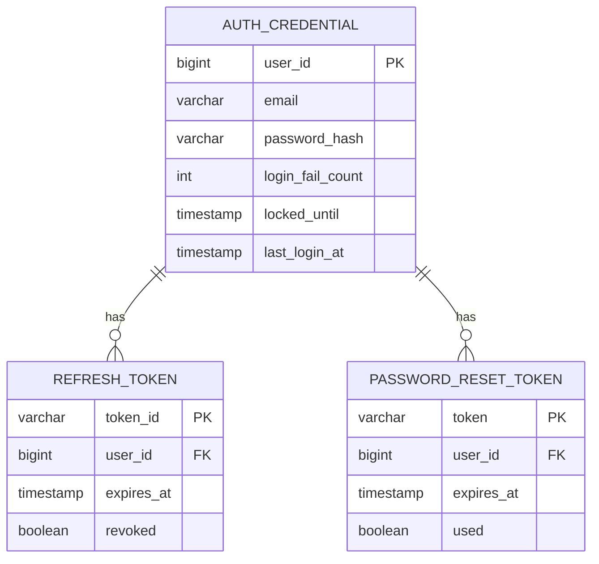

#### user-db（user-service）

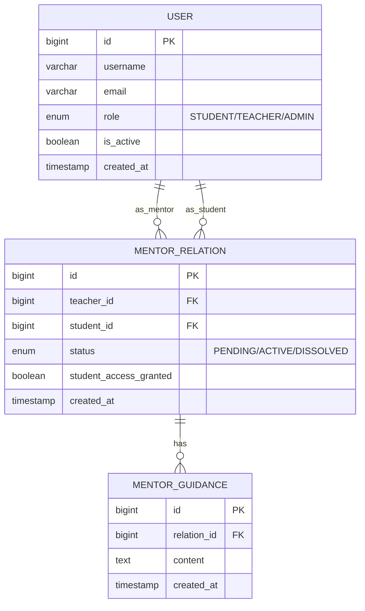

#### course-db（course-service）

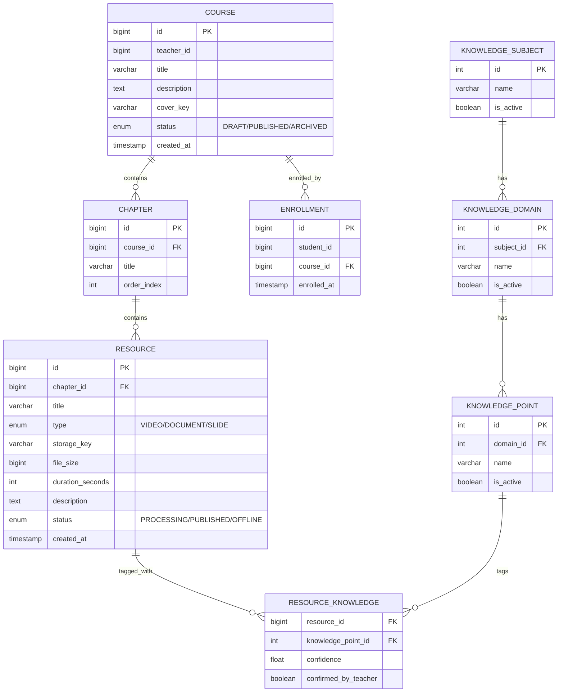

#### learn-db（learn-service）

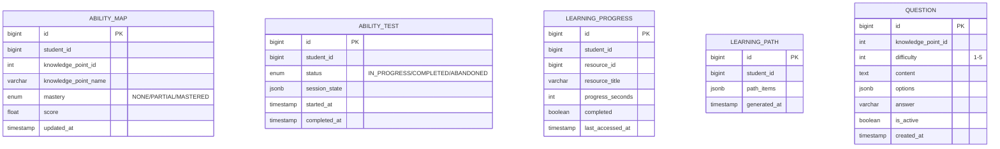

#### assign-db（assign-service）

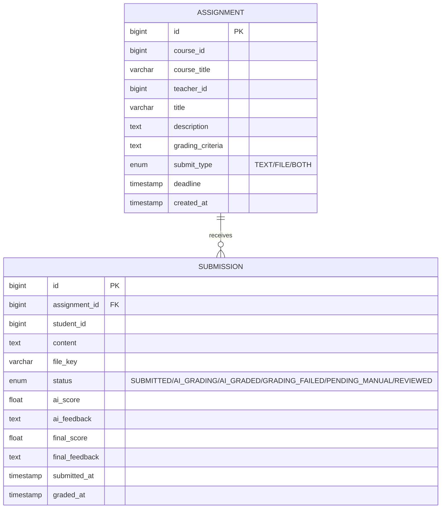

#### notify-db（notify-service）

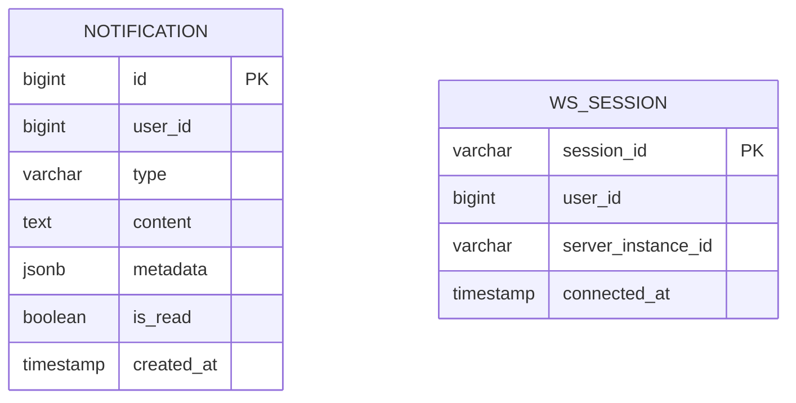

#### chat-db（chat-agent）

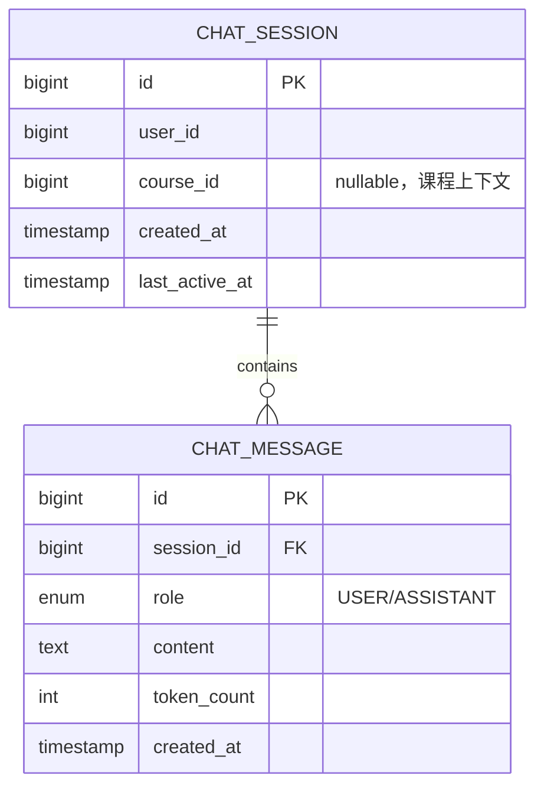

#### analysis-db（analysis-agent）

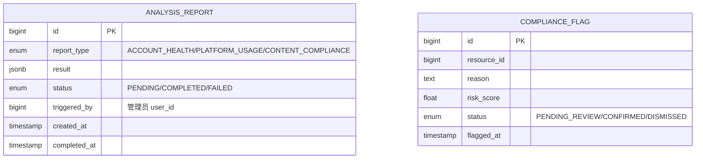

### 4.3 关键约束与索引

| 数据库 | 表 | 约束 / 索引 |
|--------|-----|------------|
| auth-db | auth_credential | UNIQUE(email) |
| auth-db | refresh_token | INDEX(user_id, revoked) |
| user-db | user | UNIQUE(email)，INDEX(role, is_active) |
| user-db | mentor_relation | UNIQUE(teacher_id, student_id)，INDEX(student_id, status) |
| course-db | resource_knowledge | PK(resource_id, knowledge_point_id) |
| course-db | enrollment | UNIQUE(student_id, course_id) |
| learn-db | ability_map | UNIQUE(student_id, knowledge_point_id) |
| learn-db | learning_progress | UNIQUE(student_id, resource_id) |
| learn-db | question | INDEX(knowledge_point_id, difficulty) |
| assign-db | submission | INDEX(assignment_id, status)，UNIQUE(assignment_id, student_id) |
| notify-db | notification | INDEX(user_id, is_read, created_at) |
| chat-db | chat_session | INDEX(user_id, last_active_at) |
| chat-db | chat_message | INDEX(session_id, created_at) |
| analysis-db | compliance_flag | INDEX(resource_id, status) |

### 4.4 冗余字段说明

微服务间禁止跨库 JOIN，部分字段在本服务数据库中冗余存储，通过 Kafka 事件保持最终一致性：

| 冗余字段 | 所在服务 | 来源服务 | 同步事件 |
|---------|---------|---------|---------|
| `ability_map.knowledge_point_name` | learn-service | course-service | `knowledge-point.updated` |
| `learning_progress.resource_title` | learn-service | course-service | `resource.updated` |
| `assignment.course_title` | assign-service | course-service | `course.updated` |


---

## 5. API 设计规范

### 5.1 基础规范

- 风格：RESTful，资源名称使用复数名词
- 基础路径：`/api/v1/`（由 API Gateway 统一前缀）
- 数据格式：JSON（`Content-Type: application/json`）
- 字符编码：UTF-8
- 时间格式：ISO 8601（`2026-03-20T10:00:00+08:00`）

### 5.2 认证方式

客户端在请求头携带：

```
Authorization: Bearer <JWT access_token>
```

JWT Payload 结构：

```json
{
  "sub": "12345",
  "role": "STUDENT",
  "iat": 1742400000,
  "exp": 1742407200
}
```

Gateway 完成 JWT 验签后，将解析结果注入下游请求头，各微服务直接读取，无需重复验签：

```
X-User-Id: 12345
X-User-Role: STUDENT
```

Token 有效期：access_token 2 小时，refresh_token 7 天（存 Redis，支持主动吊销）。

### 5.3 统一响应结构

```json
{ "code": 0, "message": "success", "data": { } }
```

分页响应：

```json
{
  "code": 0, "message": "success",
  "data": { "items": [], "total": 100, "page": 1, "pageSize": 20 }
}
```

错误响应：

```json
{ "code": 40301, "message": "无权访问该资源", "data": null }
```

### 5.4 错误码规范

| 错误码 | HTTP 状态 | 含义 |
|--------|-----------|------|
| 0 | 200 | 成功 |
| 40001 | 400 | 请求参数错误 |
| 40002 | 400 | 文件格式不支持 |
| 40003 | 400 | 文件大小超限 |
| 40101 | 401 | 未登录或 Token 失效 |
| 40102 | 401 | Token 已过期 |
| 40301 | 403 | 权限不足 |
| 40302 | 403 | 账号已被禁用 |
| 40303 | 403 | 账号已锁定 |
| 40401 | 404 | 资源不存在 |
| 40901 | 409 | 数据冲突 |
| 42901 | 429 | 请求频率超限 |
| 50001 | 500 | 服务器内部错误 |
| 50301 | 503 | 下游服务不可用 |

### 5.5 核心 API 端点

**auth-service**

```
POST   /api/v1/auth/login
POST   /api/v1/auth/logout
POST   /api/v1/auth/refresh
POST   /api/v1/auth/password/reset-request
POST   /api/v1/auth/password/reset
```

**user-service**

```
GET    /api/v1/users/{id}
GET    /api/v1/admin/users                      # 用户列表
POST   /api/v1/admin/users/batch-import         # 批量导入
PATCH  /api/v1/admin/users/{id}                 # 修改角色/状态
POST   /api/v1/mentor-relations                 # 发起导师申请
PATCH  /api/v1/mentor-relations/{id}            # 接受/拒绝/解除
GET    /api/v1/students/{id}/profile            # 学生学习档案（导师视角）
POST   /api/v1/mentor-relations/{id}/guidance   # 填写指导意见
```

**course-service**

```
GET    /api/v1/courses                          # 课程列表（含搜索/筛选）
POST   /api/v1/courses                          # 创建课程
GET    /api/v1/courses/{id}
PUT    /api/v1/courses/{id}
GET    /api/v1/courses/{id}/chapters
POST   /api/v1/courses/{id}/chapters
POST   /api/v1/chapters/{id}/resources          # 创建资源记录（上传由 media-service 处理）
GET    /api/v1/resources/{id}/play-url          # 获取视频预签名 URL
PATCH  /api/v1/resources/{id}/tags              # 教师确认/调整知识点标签
GET    /api/v1/admin/knowledge-points           # 知识点分类树
POST   /api/v1/admin/knowledge-points
PATCH  /api/v1/admin/knowledge-points/{id}
```

**learn-service**

```
GET    /api/v1/students/{id}/ability-map
POST   /api/v1/ability-tests                    # 开始测试
GET    /api/v1/ability-tests/{id}/next          # 获取下一题
POST   /api/v1/ability-tests/{id}/answer        # 提交答案
POST   /api/v1/ability-tests/{id}/finish        # 完成测试
GET    /api/v1/students/{id}/learning-path
POST   /api/v1/students/{id}/learning-path/refresh
PATCH  /api/v1/learning-progress                # 更新学习进度
GET    /api/v1/students/{id}/stats              # 学习统计
```

**assign-service**

```
POST   /api/v1/courses/{id}/assignments         # 布置作业
GET    /api/v1/assignments/{id}
POST   /api/v1/assignments/{id}/submit          # 提交作业
GET    /api/v1/assignments/{id}/submissions     # 批改列表（教师）
PATCH  /api/v1/submissions/{id}/review          # 人工复核
```

**notify-service**

```
GET    /api/v1/notifications                    # 通知列表
PATCH  /api/v1/notifications/{id}/read          # 标记已读
PATCH  /api/v1/notifications/read-all           # 全部已读
GET    /api/v1/notifications/unread-count
WS     /ws/notifications                        # WebSocket 连接
```

**media-service**

```
POST   /api/v1/uploads/init                     # 初始化断点续传
PATCH  /api/v1/uploads/{upload_id}              # tus 分片上传
HEAD   /api/v1/uploads/{upload_id}              # 查询上传进度
```

**chat-agent**

```
POST   /api/v1/chat/sessions                    # 创建会话
POST   /api/v1/chat/sessions/{id}/messages      # 发送消息（SSE 流式响应）
GET    /api/v1/chat/sessions/{id}/messages      # 历史消息
```


---

## 6. 核心模块设计

### 6.1 认证与会话模块（auth-service）

**登录流程**

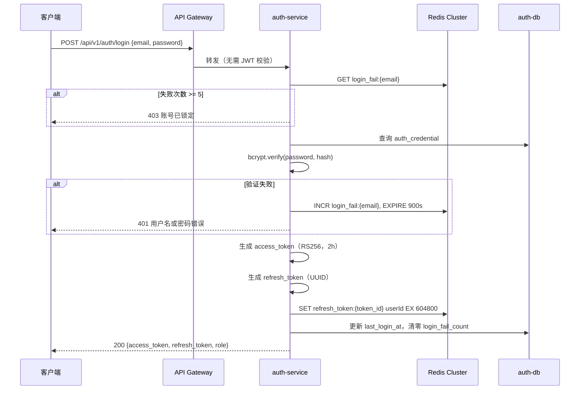

**JWT 公私钥分发**

- auth-service 持有 RSA 私钥，负责签发 JWT
- 公钥通过 Nacos 配置中心分发给 API Gateway 和各微服务
- 公钥轮换时，Nacos 推送配置变更，各服务热更新，无需重启

### 6.2 文件上传与媒体处理（media-service）

**断点续传流程（tus 协议）**

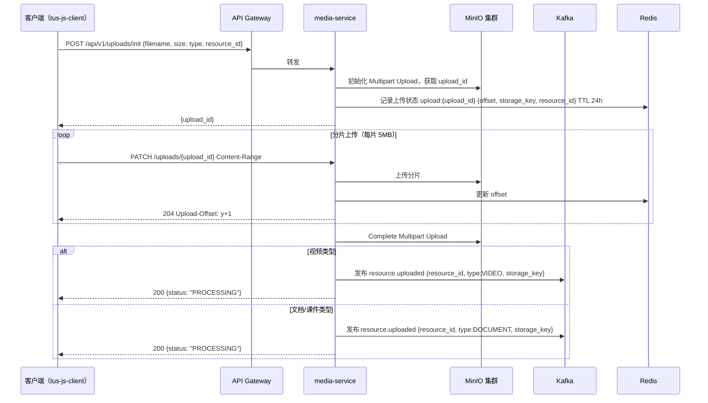

**视频转码流程**

media-service 内置 FFmpeg Worker 线程池，消费内部转码队列（非 Kafka，避免大文件传输）：

1. 从 MinIO 下载原始 MP4
2. FFmpeg 转码为多码率 HLS（360p / 720p / 1080p，2s 分片）
3. 提取音轨生成字幕（VTT 格式）
4. 上传 HLS 分片和字幕至 MinIO
5. 通知 course-service 更新 `resource.status = PUBLISHED`
6. 发布 `resource.uploaded` 事件到 Kafka，触发 tag-agent 标注

**存储路径规范**

```
videos/{year}/{month}/{resource_id}/original.mp4
videos/{year}/{month}/{resource_id}/hls/index.m3u8
videos/{year}/{month}/{resource_id}/hls/{quality}/segment_{n}.ts
videos/{year}/{month}/{resource_id}/subtitle.vtt
documents/{year}/{month}/{resource_id}/{uuid}.{ext}
assignments/{year}/{month}/{submission_id}/{uuid}.{ext}
```

MinIO 存储桶设为私有，所有访问通过 media-service 生成预签名 URL（有效期 1 小时）。

> 上传状态仅存储在 Redis（TTL 24 小时），Redis 重启后进行中的上传记录会丢失，客户端需重新调用 `/uploads/init` 初始化新的上传任务。已完成上传并写入 MinIO 的文件不受影响。

### 6.3 能力图谱测试（learn-service）

**自适应测试引擎**

题目存储在 learn-db 的 `questions` 表，含字段：`knowledge_point_id`、`difficulty`（1–5）、`content`、`options`、`answer`。

自适应算法（简化 IRT）：

- 初始难度：3（中等）
- 答对：下一题难度 +1（上限 5）；答错：下一题难度 -1（下限 1）
- 每个知识点最少 3 题、最多 7 题
- 连续 3 题同难度全对 → 标记"已掌握"；连续 3 题同难度全错 → 标记"未掌握"

测试进度保存在 Redis（`test_session:{test_id}`，TTL 7 天），支持断点继续。测试完成后发布 `ability.updated` 事件到 Kafka，触发 nav-agent 重算路线。

### 6.4 个性化学习路线（learn-service + nav-agent）

**路线生成流程**

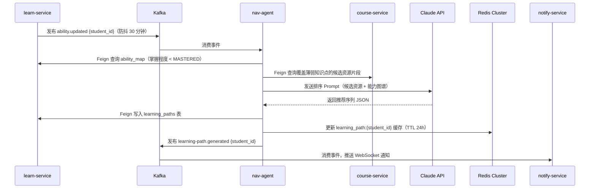

路线缓存在 Redis，学习进度更新时失效并触发重新生成（防抖 30 分钟，避免频繁重算）。

### 6.5 作业批改（assign-service + grade-agent）

**提交状态机**

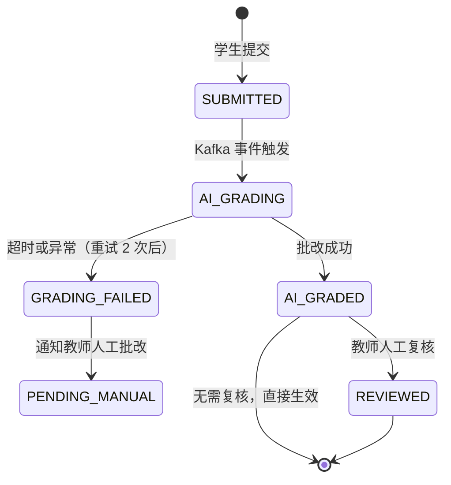

**批改流程**

1. 学生提交作业，assign-service 写入 DB，发布 `submission.created` 到 Kafka
2. grade-agent 消费事件，从 MinIO 下载附件（如有），提取文本
3. 调用 Claude API 批改，超时设置：简单作业 60s，复杂作业 300s
4. 批改成功：发布 `submission.graded` 事件，assign-service 更新状态，notify-service 通知师生
5. 批改失败（重试 2 次后）：发布 `submission.grading-failed` 事件，置 `PENDING_MANUAL`，通知教师

### 6.6 站内通知（notify-service）

**WebSocket 多实例路由**

分布式部署下，多个 notify-service 实例各自维护 WebSocket 连接，需要跨实例路由消息：

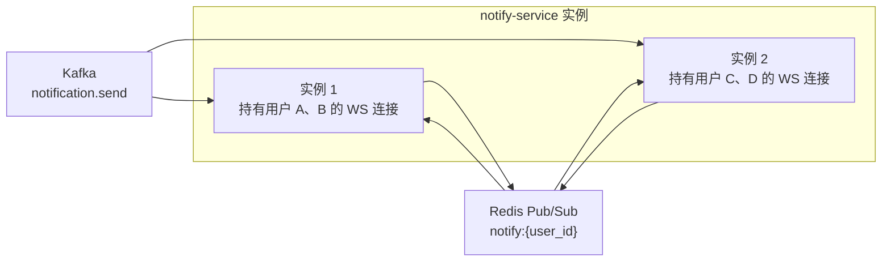

- 所有实例订阅 Kafka `notification.send` Topic
- 收到消息后，先写入 notify-db 持久化
- 通过 Redis Pub/Sub 广播到所有实例，持有该用户 WebSocket 连接的实例负责推送
- 用户离线时，下次登录拉取未读通知列表


---

## 7. AI 智能体集成方案

### 7.1 智能体服务架构

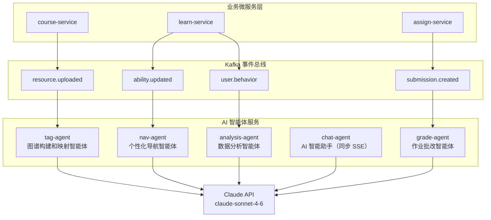

所有 AI 智能体服务均为独立微服务，注册到 Nacos，可独立扩缩容。chat-agent 通过 API Gateway 同步路由，其余智能体通过 Kafka 异步驱动。

### 7.2 tag-agent（图谱构建和映射智能体）

**触发**：消费 Kafka `resource.uploaded` 事件。

**数据流**：

```
输入：
  - resource_id、资源类型（VIDEO/DOCUMENT/SLIDE）
  - 文本内容（视频字幕 VTT / 文档提取文本 / 标题+简介降级）
  - 知识点分类树（Feign 调用 course-service，Redis 缓存 1 小时）

处理：
  1. 从 MinIO 下载文件，解析文本（PyMuPDF / python-pptx / VTT）
  2. 构建 Prompt，要求 Claude 仅从分类树中匹配知识点（防幻觉）
  3. Claude 返回 JSON：[{knowledge_point_id, name, confidence}]
  4. Feign 调用 course-service 写入 resource_knowledge（confirmed=false）

输出：
  - 建议标签列表（含置信度，按置信度降序）
  - 发布 resource.tagged 事件，notify-service 通知教师确认
```

**降级处理**：无字幕或文件无法解析时，降级为基于标题和简介分析，界面提示"内容解析受限，建议手动补充标签"。

### 7.3 nav-agent（个性化导航智能体）

**触发**：消费 Kafka `ability.updated` 事件（防抖 30 分钟）。

**数据流**：

```
输入：
  - student_id
  - ability_map（Feign 调用 learn-service，过滤 mastery=MASTERED）
  - 候选资源列表（Feign 调用 course-service，查询覆盖薄弱知识点的资源片段）

处理：
  1. 筛选掌握程度 < MASTERED 的知识点
  2. 查询覆盖这些知识点的资源片段（含课程/章节信息）
  3. 调用 Claude 对候选资源排序，生成推荐序列
  4. Claude 返回 JSON：[{resource_id, knowledge_point_id, reason, priority}]
  5. Feign 调用 learn-service 写入 learning_paths 表
  6. 更新 Redis 缓存 learning_path:{student_id}（TTL 24h）

输出：
  - 有序推荐列表（精确到资源片段，含推荐理由）
  - 发布 learning-path.generated 事件，notify-service 推送 WebSocket 通知
```

**跨课程推荐逻辑**：同一知识点可能有多个课程的资源片段覆盖，Claude 根据资源描述、标题、知识点置信度综合排序，选出最优片段，不限定来源课程。

### 7.4 grade-agent（作业批改智能体）

**触发**：消费 Kafka `submission.created` 事件。

**数据流**：

```
输入：
  - submission_id
  - 提交内容（文字内容 / 从 MinIO 下载附件后提取文本）
  - 评分标准（Feign 调用 assign-service 查询 grading_criteria）

处理：
  1. 解析提交内容（文字直接使用，文件用 PyMuPDF 提取文本）
  2. 构建批改 Prompt，包含评分标准和提交内容
  3. 调用 Claude 生成评分和评语
  4. Claude 返回 JSON：{score, feedback, strengths, weaknesses}
  5. Feign 调用 assign-service 更新 submission（ai_score, ai_feedback, status=AI_GRADED）

输出：
  - 评分 + 详细评语（优点和不足）
  - 发布 submission.graded 事件，notify-service 通知师生
```

**异常处理**：超时或 Claude 调用失败时重试 2 次，仍失败则发布 `submission.grading-failed` 事件，assign-service 置 `PENDING_MANUAL`，通知教师人工批改，不向学生展示任何评分。

### 7.5 chat-agent（AI 智能助手）

**触发**：API Gateway 同步路由，SSE 流式响应。

**数据流**：

```
输入：
  - session_id（多轮对话上下文）
  - 用户消息文本
  - 当前课程上下文（course_id，可选）

处理：
  1. 从本地 DB 加载历史消息（最近 20 条，滑动窗口控制 Token 用量）
  2. 构建对话 Prompt（含课程上下文）
  3. 调用 Claude API（流式模式）
  4. 实时将 token 通过 SSE 推送给客户端
  5. 完整响应写入 chat_messages 表

输出：
  - 流式文本响应（SSE）
  - 持久化对话历史
```

chat-agent 维护自己的 chat-db（PostgreSQL），存储会话和消息记录，不依赖其他业务服务。

### 7.6 analysis-agent（数据分析智能体）

**触发**：管理员手动触发（按需生成）；持续消费 Kafka `user.behavior` 事件积累数据。

**分析场景**：

| 场景 | 输入数据 | 输出 |
|------|---------|------|
| 账号健康度评估 | 用户登录频率、活跃度、异常登录记录 | 账号健康度报告，标记异常账号 |
| 平台使用分析 | 功能模块访问频率、操作路径、用户行为日志 | 功能接受度分析、隐藏需求挖掘、优化建议 |
| 内容合规预审 | 新上传课程资料文本内容 | 合规风险评估，标记疑似违规内容（召回率 ≥ 90%，误判率 ≤ 5%） |

所有分析结果仅作为辅助参考，最终决策由管理员执行。

**输出存储**：分析结果持久化到 analysis-db（PostgreSQL）：
- 账号健康度报告和平台使用分析写入 `analysis_report` 表
- 内容合规预审结果写入 `compliance_flag` 表，并通过 Kafka `notification.send` 事件通知管理员

管理员通过 `/admin/stats` 路由查看报告，对应 analysis-agent 提供以下 API 端点（经 API Gateway 路由）：

```
GET    /api/v1/analysis/reports              # 报告列表（管理员）
POST   /api/v1/analysis/reports              # 手动触发分析任务
GET    /api/v1/analysis/reports/{id}         # 报告详情
GET    /api/v1/analysis/compliance-flags     # 合规预警列表
PATCH  /api/v1/analysis/compliance-flags/{id} # 处置合规预警（确认/驳回）
```


---

## 8. 安全设计

### 8.1 传输安全

- 全站强制 HTTPS，API Gateway 配置 HTTP → HTTPS 301 重定向
- TLS 版本：TLS 1.2+，禁用 TLS 1.0 / 1.1
- HSTS 响应头：`Strict-Transport-Security: max-age=31536000; includeSubDomains`
- 微服务间内部通信（集群内）走 HTTP，通过 K8s NetworkPolicy 限制只允许服务间互访，不对外暴露
- 视频流媒体通过 CDN 分发，同样走 HTTPS

### 8.2 认证与会话安全

- 密码使用 bcrypt 加密存储（cost factor ≥ 12），禁止明文存储
- JWT 使用 RS256 非对称签名，私钥仅 auth-service 持有，公钥通过 Nacos 分发
- access_token 有效期 2 小时，refresh_token 有效期 7 天，存储于 Redis（支持主动吊销）
- Token 吊销：logout 时将 token_id 写入 Redis 黑名单（TTL 与 Token 剩余有效期一致），Gateway 验签后检查黑名单
- 登录失败 5 次锁定账号 15 分钟，计数器存 Redis，TTL 15 分钟
- 密码重置链接有效期 30 分钟，使用后立即失效（一次性 Token）

### 8.3 访问控制

- API Gateway 完成 JWT 验签，将 `userId`、`role` 注入下游请求头
- 各微服务基于请求头中的 `X-User-Role` 进行方法级权限校验（Spring Security 注解）
- 学生只能访问自己的学习数据，跨用户访问返回 403
- 课程资源访问与选课状态绑定：course-service 校验 enrollment 记录，未选课学生返回 403
- 导师只能访问已建立关系且 `student_access_granted=true` 的学生档案
- 导师视角下屏蔽学生手机号、身份证号、家庭住址等个人身份信息
- 作业原始提交内容不对导师开放，仅展示评分和评语
- MinIO 存储桶设为私有，所有文件访问通过 media-service 生成预签名 URL（有效期 1 小时）
- 微服务间 Feign 调用携带内部服务凭证头 `X-Internal-Token`，防止绕过 Gateway 直接调用内部服务

### 8.4 输入验证与防注入

- 所有用户输入在各微服务后端进行严格校验（Spring Validation），不信任前端校验
- 数据库操作全部使用 JPA 参数化查询，禁止拼接 SQL，防止 SQL 注入
- 富文本内容（讨论区帖子）使用白名单过滤，防止 XSS
- API Gateway 配置全局 CSRF Token 校验（非 GET 请求）
- 文件上传校验：MIME 类型白名单 + 文件头魔数双重验证，防止文件类型伪造

### 8.5 文件安全

- 上传文件进行病毒扫描（ClamAV 集成到 media-service），扫描失败则拒绝存储
- 文件名规范化处理，防止路径穿越攻击（`../` 等）
- 视频转码在隔离的 Worker 线程中执行
- 文件存储路径使用 UUID 命名，不暴露原始文件名

### 8.6 限流与防攻击

限流在 API Gateway 层统一实施，使用 Redis 滑动窗口算法：

| 接口 | 限流规则 |
|------|---------|
| POST /auth/login | 同 IP 每分钟 ≤ 10 次 |
| POST /auth/password/reset-request | 同邮箱每小时 ≤ 3 次 |
| POST /uploads/init | 同用户每分钟 ≤ 5 次 |
| POST /chat/sessions/{id}/messages | 同用户每分钟 ≤ 30 次 |
| 其他 API | 同用户每分钟 ≤ 200 次 |

超限返回 429，响应头包含 `Retry-After`。

### 8.7 分布式安全补充

- **服务间信任**：集群内服务间通信通过 K8s NetworkPolicy 白名单控制，仅允许已知服务互访
- **配置安全**：数据库密码、Claude API Key 等敏感配置通过 K8s Secret 注入，不写入代码或配置文件
- **Kafka 安全**：生产环境启用 SASL/SCRAM 认证，各服务使用独立账号，按 Topic 授权读写权限


---

## 9. 部署架构

### 9.1 环境划分

| 环境 | 用途 | 部署方式 |
|------|------|---------|
| 开发环境 | 本地开发调试 | Docker Compose（全量服务） |
| 测试环境 | 集成测试、QA 验收 | Docker Compose（单机） |
| 生产环境 | 正式对外服务 | Kubernetes 集群（多节点） |

### 9.2 Docker Compose 服务清单（开发/测试）

```yaml
services:
  # 接入层
  gateway:          # Spring Cloud Gateway，端口 8080
  nacos:            # 服务注册与发现 + 配置中心，端口 8848

  # 业务微服务
  auth-service:     # 端口 8001
  user-service:     # 端口 8002
  course-service:   # 端口 8003
  learn-service:    # 端口 8004
  assign-service:   # 端口 8005
  notify-service:   # 端口 8006
  media-service:    # 端口 8007

  # AI 智能体服务
  tag-agent:        # 端口 8101
  nav-agent:        # 端口 8102
  grade-agent:      # 端口 8103
  chat-agent:       # 端口 8104
  analysis-agent:   # 端口 8105

  # 消息层
  kafka:            # 端口 9092
  kafka-ui:         # 端口 8090（开发可视化）
  zookeeper:        # 端口 2181

  # 消息层
  kafka:            # 端口 9092
  kafka-ui:         # 端口 8090（开发可视化）
  zookeeper:        # 端口 2181

  # 数据层
  postgres:         # 端口 5432（开发环境单实例，多 Schema 隔离）
  redis:            # 端口 6379
  minio:            # 端口 9000 / 9001（控制台）

  # 前端
  frontend:         # Vue 3 SPA，Nginx 静态服务，端口 80
```

> 开发环境 PostgreSQL 使用单实例多 Schema 隔离（`auth`、`user`、`course`、`learn`、`assign`、`notify`、`chat`、`analysis`），生产环境各服务独立实例。

### 9.3 生产环境 Kubernetes 部署图

```mermaid
graph TB
    subgraph Internet["公网"]
        User["用户浏览器"]
    end

    subgraph CDN["CDN 层"]
        CDNNode["CDN 节点\n静态资源 + 视频分发"]
    end

    subgraph K8s["Kubernetes 集群"]
        subgraph Ingress["接入层 Namespace: ingress"]
            IngressCtrl["Nginx Ingress Controller\nHTTPS 终止"]
            GWPod["gateway Deployment\n2–6 副本\nSpring Cloud Gateway"]
        end

        subgraph Infra["基础设施 Namespace: infra"]
            NacosSS["nacos StatefulSet\n3 节点集群"]
            KafkaSS["kafka StatefulSet\n3 Broker"]
            ZkSS["zookeeper StatefulSet\n3 节点"]
            RedisSS["redis StatefulSet\n3 主 + 3 从 Cluster"]
            MinioSS["minio StatefulSet\n4 节点纠删码集群"]
        end

        subgraph BizNS["业务服务 Namespace: biz"]
            AuthDep["auth-service\n2–4 副本"]
            UserDep["user-service\n2–4 副本"]
            CourseDep["course-service\n2–6 副本"]
            LearnDep["learn-service\n2–6 副本"]
            AssignDep["assign-service\n2–4 副本"]
            NotifyDep["notify-service\n2–4 副本"]
            MediaDep["media-service\n2–4 副本"]
        end

        subgraph AINS["AI 服务 Namespace: ai"]
            TagDep["tag-agent\n1–3 副本"]
            NavDep["nav-agent\n1–3 副本"]
            GradeDep["grade-agent\n1–4 副本"]
            ChatDep["chat-agent\n2–6 副本"]
            AnalysisDep["analysis-agent\n1–2 副本"]
        end

        subgraph DBNS["数据库 Namespace: data"]
            AuthDB["auth-db\nPostgreSQL StatefulSet\n主从"]
            UserDB["user-db\nPostgreSQL StatefulSet\n主从"]
            CourseDB["course-db\nPostgreSQL StatefulSet\n主从"]
            LearnDB["learn-db\nPostgreSQL StatefulSet\n主从"]
            AssignDB["assign-db\nPostgreSQL StatefulSet\n主从"]
            NotifyDB["notify-db\nPostgreSQL StatefulSet\n主从"]
            ChatDB["chat-db\nPostgreSQL StatefulSet\n主从"]
            AnalysisDB["analysis-db\nPostgreSQL StatefulSet\n主从"]
            VectorDB["vector-db\nPostgreSQL + pgvector\n主从"]
        end
    end

    subgraph External["外部服务"]
        Claude["Claude API"]
        SMTP["SMTP"]
    end

    User --> CDNNode
    User --> IngressCtrl
    CDNNode --> MinioSS
    IngressCtrl --> GWPod

    GWPod --> AuthDep & UserDep & CourseDep & LearnDep & AssignDep & NotifyDep & MediaDep & ChatDep
    GWPod & BizNS --> NacosSS

    BizNS --> KafkaSS
    AINS --> KafkaSS
    KafkaSS --> ZkSS

    AuthDep --> AuthDB
    UserDep --> UserDB
    CourseDep --> CourseDB
    LearnDep --> LearnDB
    AssignDep --> AssignDB
    NotifyDep --> NotifyDB
    ChatDep --> ChatDB
    AnalysisDep --> AnalysisDB
    TagDep & NavDep --> VectorDB

    BizNS & GWPod --> RedisSS
    MediaDep --> MinioSS
    TagDep & GradeDep --> MinioSS

    AINS --> Claude
    NotifyDep --> SMTP
```

### 9.4 各服务 HPA 配置

| 服务 | 初始副本 | 最大副本 | HPA 触发条件 |
|------|---------|---------|-------------|
| gateway | 2 | 6 | CPU > 70% |
| auth-service | 2 | 4 | CPU > 70% |
| user-service | 2 | 4 | CPU > 70% |
| course-service | 2 | 6 | CPU > 70% |
| learn-service | 2 | 6 | CPU > 70% |
| assign-service | 2 | 4 | CPU > 70% |
| notify-service | 2 | 4 | 连接数 > 200/副本 |
| media-service | 2 | 4 | CPU > 60% 或内存 > 70% |
| tag-agent | 1 | 3 | Kafka 消费延迟 > 30s |
| nav-agent | 1 | 3 | Kafka 消费延迟 > 30s |
| grade-agent | 1 | 4 | Kafka 消费延迟 > 60s |
| chat-agent | 2 | 6 | CPU > 60% 或活跃 SSE 连接数 > 100/副本 |
| analysis-agent | 1 | 2 | 手动触发，不自动扩容 |

### 9.5 资源配置（单 Pod）

| 服务 | CPU Request | CPU Limit | Memory Request | Memory Limit |
|------|------------|-----------|---------------|-------------|
| gateway | 250m | 1000m | 256Mi | 1Gi |
| 业务微服务（Java） | 500m | 2000m | 512Mi | 2Gi |
| AI 智能体（Python） | 500m | 2000m | 512Mi | 2Gi |
| media-service | 1000m | 4000m | 1Gi | 4Gi |

### 9.6 CI/CD 流水线

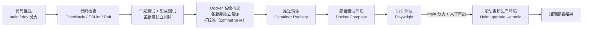

- 各微服务独立构建镜像，只有变更的服务才触发重新构建和部署
- 生产部署使用 `helm upgrade --atomic`，失败自动回滚
- 保留最近 5 个 Helm Release 版本，支持一键回滚到任意历史版本

### 9.7 监控与告警

**全链路监控（Prometheus + Grafana + Jaeger）**

| 监控类型 | 工具 | 覆盖范围 |
|---------|------|---------|
| 指标监控 | Prometheus + Grafana | CPU/内存/网络、API 响应时间（P50/P95/P99）、错误率、Kafka 消费延迟 |
| 分布式链路追踪 | Jaeger | 跨服务请求链路，定位性能瓶颈和故障根因 |
| 日志聚合 | ELK Stack | 所有服务日志集中检索，保留 ≥ 90 天 |
| 业务指标 | Grafana 自定义面板 | 在线用户数、视频并发流数、AI 任务队列积压量 |

**告警规则**

| 告警条件 | 级别 | 响应动作 |
|---------|------|---------|
| 任意服务错误率 > 5%（持续 5 分钟） | P1 | 立即通知值班人员 |
| Gateway P99 响应时间 > 5s（持续 5 分钟） | P2 | 通知开发团队 |
| Kafka 消费延迟 > 5 分钟 | P2 | 自动扩容对应 AI 智能体副本 |
| 任意 PostgreSQL 主库不可用 | P1 | 自动切换从库，立即通知 |
| Redis Cluster 节点故障 | P1 | 立即通知，触发故障转移 |
| MinIO 节点故障 | P2 | 通知运维，纠删码保障数据完整性 |
| 磁盘使用率 > 80% | P2 | 通知运维扩容存储 |

### 9.8 数据备份策略

| 数据类型 | 备份方式 | 频率 | 保留周期 |
|---------|---------|------|---------|
| 各 PostgreSQL 实例 | pg_dump 全量 + WAL 流复制 | 每日全量，实时增量 | 30 天 |
| Redis Cluster | RDB 快照 + AOF 持久化 | 每小时 RDB | 7 天 |
| MinIO 文件 | 4 节点纠删码（2+2），跨可用区部署 | 实时冗余 | 永久 |
| Kafka 消息 | Topic 副本数 3，保留 7 天 | 实时冗余 | 7 天 |
| 备份文件 | 异地存储（不同可用区） | 随主备份 | 同上 |

恢复目标：RTO ≤ 2 小时，RPO ≤ 24 小时（关键操作数据实时写入，实际丢失窗口远小于 24 小时）。


---

## 10. 关键流程时序图

### 10.1 教师发布资源 → AI 标注 → 图谱构建

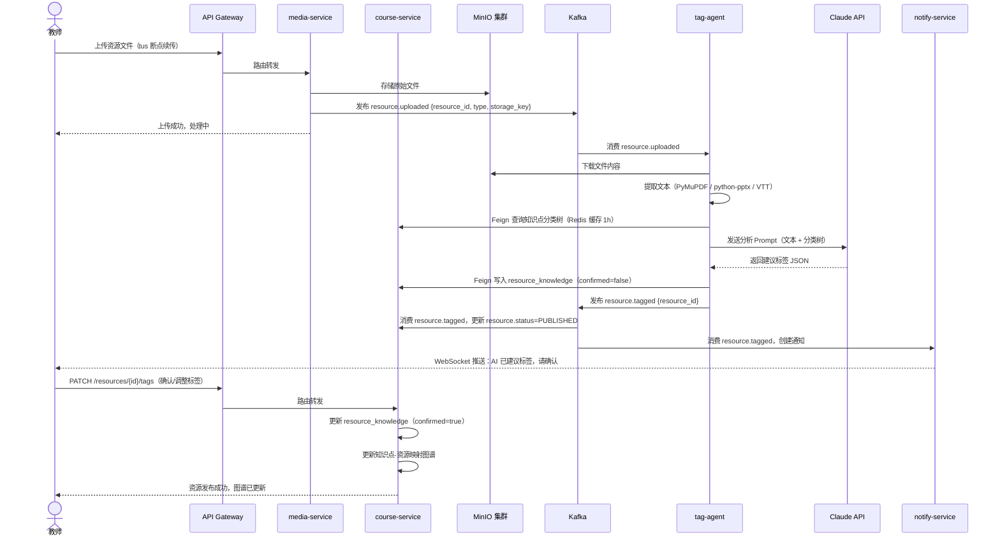

### 10.2 学生学习进度更新 → 路线动态调整

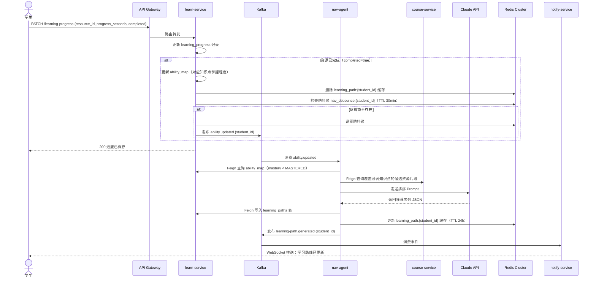

### 10.3 作业提交 → AI 批改 → 通知师生

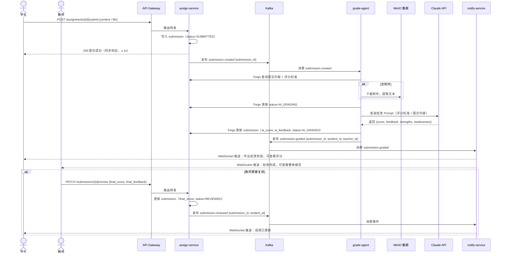

### 10.4 导师-学生关系建立与档案访问

```mermaid
sequenceDiagram
    actor Teacher as 教师（导师）
    actor Student as 学生
    participant GW as API Gateway
    participant UserSvc as user-service
    participant LearnSvc as learn-service
    participant AssignSvc as assign-service
    participant Kafka as Kafka
    participant Notify as notify-service

    Teacher->>GW: POST /mentor-relations {student_id}
    GW->>UserSvc: 路由转发
    UserSvc->>UserSvc: 创建 mentor_relation（status=PENDING）
    UserSvc->>Kafka: 发布 notification.send {user_id=student_id, type=MENTOR_REQUEST}
    Kafka->>Notify: 消费事件，持久化通知
    Notify-->>Student: WebSocket 推送：收到导师申请

    Student->>GW: PATCH /mentor-relations/{id} {action: "ACCEPT"}
    GW->>UserSvc: 路由转发
    UserSvc->>UserSvc: 更新 mentor_relation（status=ACTIVE）
    UserSvc->>Kafka: 发布 notification.send {user_id=teacher_id, type=MENTOR_ACCEPTED}
    Kafka->>Notify: 消费事件
    Notify-->>Teacher: WebSocket 推送：学生已接受导师申请

    Teacher->>GW: GET /students/{id}/profile
    GW->>UserSvc: 路由转发
    UserSvc->>UserSvc: 验证 mentor_relation（ACTIVE + student_access_granted=true）
    UserSvc->>LearnSvc: Feign 查询能力图谱、学习路径
    UserSvc->>AssignSvc: Feign 查询作业成绩记录（仅评分和评语，不含原始提交）
    UserSvc-->>Teacher: 返回学习档案（屏蔽个人身份信息）

    Teacher->>GW: POST /mentor-relations/{id}/guidance {content}
    GW->>UserSvc: 路由转发
    UserSvc->>UserSvc: 保存指导意见
    UserSvc->>Kafka: 发布 notification.send {user_id=student_id, type=MENTOR_GUIDANCE}
    Kafka->>Notify: 消费事件
    Notify-->>Student: WebSocket 推送：收到导师指导意见
```


---

## 11. 前端模块设计

### 11.1 路由结构

```
/                          # 重定向至登录页或角色首页
/login                     # 登录页
/password-reset            # 密码重置

# 学生路由（/student/*）
/student/dashboard                                              # 首页（课程列表 + 学习进度）
/student/ability-map                                            # 能力图谱
/student/ability-test                                           # 能力图谱测试
/student/learning-path                                          # 个性化学习路线
/student/courses/:id                                            # 课程详情
/student/courses/:id/chapters/:chapterId/resources/:resourceId  # 资源学习页
/student/assignments                                            # 作业列表
/student/assignments/:id                                        # 作业详情 + 提交
/student/chat                                                   # AI 智能助手
/student/notifications                                          # 消息通知
/student/profile                                                # 个人设置

# 教师路由（/teacher/*）
/teacher/dashboard                    # 首页（课程管理概览）
/teacher/courses                      # 课程列表
/teacher/courses/create               # 创建课程
/teacher/courses/:id/edit             # 编辑课程
/teacher/courses/:id/chapters         # 章节与资源管理
/teacher/courses/:id/assignments      # 作业管理
/teacher/courses/:id/graph            # 图谱分析报告
/teacher/assignments/:id/submissions  # 批改列表
/teacher/students                     # 学生管理（导师关系）
/teacher/notifications                # 消息通知

# 管理员路由（/admin/*）
/admin/dashboard          # 平台统计概览
/admin/users              # 用户账号管理
/admin/knowledge-points   # 知识点分类体系
/admin/content-review     # 内容审核
/admin/stats              # 数据统计报告
```

### 11.2 状态管理（Pinia Store）

| Store | 职责 |
|-------|------|
| `useAuthStore` | 用户信息、Token、角色、登录/登出、Token 刷新 |
| `useCourseStore` | 课程列表、当前课程详情、章节资源树 |
| `useAbilityStore` | 能力图谱数据、测试进行状态 |
| `useLearningPathStore` | 个性化学习路线、进度缓存 |
| `useNotificationStore` | 通知列表、未读数量、WebSocket 连接管理 |
| `useChatStore` | 当前会话消息列表、SSE 流状态 |

### 11.3 关键组件

| 组件 | 说明 |
|------|------|
| `AbilityMapChart` | ECharts 雷达图，展示各知识点掌握程度，支持按学科/知识领域筛选 |
| `LearningPathTimeline` | 推荐路线时间轴，支持点击跳转至对应资源 |
| `VideoPlayer` | Video.js 封装，支持 HLS 自适应码率、断点续播、倍速（0.75x–2x） |
| `FileUploader` | tus-js-client 封装，支持断点续传、进度展示、格式/大小前置校验 |
| `ChatWindow` | SSE 流式消息渲染，支持多轮对话、转发至讨论区 |
| `KnowledgeTagSelector` | 知识点分类树选择器，支持关键词搜索快速定位 |
| `NotificationBell` | 导航栏通知图标，WebSocket 实时更新未读数，断线自动降级轮询 |
| `SubmissionStatusBadge` | 作业提交状态徽章，实时反映批改进度 |

### 11.4 视频播放页设计要点

- 视频播放器居左，章节/资源列表居右（可折叠）
- 播放进度每 10 秒自动上报一次（防抖，避免频繁请求）
- 视频播放完成后自动标记"已完成"，触发能力图谱更新
- AI 智能助手悬浮入口，点击展开侧边对话框，不打断视频播放
- 支持全屏模式，全屏时隐藏侧边栏

### 11.5 WebSocket 连接管理

客户端与 notify-service 建立 WebSocket 长连接，统一由 `useNotificationStore` 管理：

- 登录成功后自动建立连接，携带 JWT Token 鉴权
- 心跳检测：每 30 秒发送 ping，超时 10 秒未收到 pong 则重连
- 断线重连：指数退避策略（1s → 2s → 4s → 8s，最大 30s）
- 重连成功后拉取离线期间的未读通知
- 登出时主动关闭连接


---

## 12. 后端代码结构

### 12.1 微服务通用结构（以 course-service 为例）

每个 Java 微服务遵循统一的包结构：

```
course-service/
├── src/main/java/com/cloudteachingai/course/
│   ├── CourseServiceApplication.java       # 启动类
│   ├── config/
│   │   ├── SecurityConfig.java             # 从请求头读取 X-User-Id / X-User-Role
│   │   ├── FeignConfig.java                # Feign 拦截器（注入内部服务凭证头）
│   │   └── KafkaConfig.java                # Kafka Producer 配置
│   ├── controller/
│   │   ├── CourseController.java
│   │   ├── ChapterController.java
│   │   ├── ResourceController.java
│   │   └── KnowledgePointController.java
│   ├── service/
│   │   ├── CourseService.java
│   │   ├── ResourceService.java
│   │   ├── KnowledgePointService.java
│   │   └── GraphService.java               # 知识点-资源映射图谱
│   ├── event/
│   │   ├── producer/
│   │   │   └── ResourceEventProducer.java  # 发布 resource.tagged 等事件
│   │   └── consumer/
│   │       └── ResourceTaggedConsumer.java # 消费 resource.tagged，更新图谱
│   ├── client/
│   │   └── MediaServiceClient.java         # Feign 客户端（调用 media-service）
│   ├── repository/
│   ├── entity/
│   ├── dto/
│   ├── exception/
│   │   ├── GlobalExceptionHandler.java
│   │   └── BusinessException.java
│   └── util/
│       └── SecurityContextUtil.java        # 从请求头提取当前用户信息
├── src/main/resources/
│   ├── application.yml                     # 基础配置（端口、数据源）
│   └── bootstrap.yml                       # Nacos 配置中心地址
└── Dockerfile
```

### 12.2 各微服务核心类清单

**auth-service**

```
controller/  AuthController.java
service/     AuthService.java, TokenService.java
event/       producer/ LoginEventProducer.java
```

**user-service**

```
controller/  UserController.java, MentorController.java, AdminUserController.java
service/     UserService.java, MentorService.java
client/      LearnServiceClient.java, AssignServiceClient.java
event/       producer/ MentorEventProducer.java
```

**learn-service**

```
controller/  AbilityMapController.java, AbilityTestController.java,
             LearningPathController.java, LearningProgressController.java
service/     AbilityTestService.java（自适应测试引擎）,
             LearningPathService.java（路线缓存管理）,
             LearningProgressService.java
client/      CourseServiceClient.java
event/       producer/ AbilityUpdatedProducer.java
             consumer/ LearningPathGeneratedConsumer.java
```

**assign-service**

```
controller/  AssignmentController.java, SubmissionController.java
service/     AssignmentService.java, SubmissionService.java
client/      CourseServiceClient.java
event/       producer/ SubmissionEventProducer.java
             consumer/ SubmissionGradedConsumer.java
```

**notify-service**

```
controller/  NotificationController.java
websocket/   NotificationWebSocketHandler.java（WebSocket 连接管理）
             WebSocketSessionRegistry.java（本实例连接注册表）
service/     NotificationService.java, WebSocketBroadcastService.java
event/       consumer/ NotificationSendConsumer.java（消费所有 notification.send 事件）
```

**media-service**

```
controller/  UploadController.java（tus 协议实现）
service/     UploadService.java, VideoTranscodeService.java（FFmpeg Worker 线程池）
             PresignedUrlService.java（MinIO 预签名 URL）
event/       producer/ ResourceUploadedProducer.java
```

### 12.3 AI 智能体服务目录结构

所有 AI 智能体服务遵循统一的 Python 目录结构：

```
{agent-name}/
├── main.py                         # FastAPI 入口（chat-agent）或 Kafka 消费入口
├── agent/
│   └── {agent_name}.py             # 核心智能体逻辑（Claude API 调用）
├── consumer/
│   └── kafka_consumer.py           # aiokafka 异步消费者（非 chat-agent）
├── client/
│   ├── feign_client.py             # 调用业务微服务的 HTTP 客户端
│   └── minio_client.py             # MinIO 文件下载
├── parser/
│   ├── pdf_parser.py               # PyMuPDF 文档解析
│   ├── pptx_parser.py              # python-pptx 解析
│   └── vtt_parser.py               # 视频字幕解析
├── utils/
│   ├── claude_client.py            # Anthropic SDK 封装（含重试、超时）
│   └── prompt_builder.py           # Prompt 模板管理
├── config.py                       # 环境变量配置（从 Nacos 或 K8s Secret 读取）
├── requirements.txt
└── Dockerfile
```

**chat-agent 特殊结构**（同步 SSE，需 FastAPI 路由）：

```
chat-agent/
├── main.py
├── router/
│   └── chat_router.py              # POST /api/v1/chat/sessions 等路由
├── agent/
│   └── chat_agent.py               # 多轮对话逻辑，滑动窗口上下文管理
├── db/
│   ├── session.py                  # asyncpg 连接池
│   └── chat_repository.py          # 会话和消息 CRUD
└── ...（同上）
```

**analysis-agent 特殊结构**（同步 HTTP + 异步 Kafka 消费，需 FastAPI 路由）：

```
analysis-agent/
├── main.py
├── router/
│   └── analysis_router.py          # GET/POST /api/v1/analysis/reports 等路由
├── agent/
│   └── analysis_agent.py           # 分析逻辑（账号健康度、平台使用、合规预审）
├── consumer/
│   └── kafka_consumer.py           # 消费 user.behavior 事件积累行为数据
├── db/
│   ├── session.py                  # asyncpg 连接池
│   └── analysis_repository.py      # 报告和合规预警 CRUD
└── ...（同上）
```

### 12.4 Nacos 配置中心规划

各微服务从 Nacos 读取配置，按 `{service-name}-{env}.yaml` 命名：

```
# 公共配置（所有服务共享）
common-config.yaml
  - jwt.public-key: <RSA 公钥>
  - kafka.bootstrap-servers: kafka:9092
  - redis.cluster.nodes: redis-0:6379,...

# 各服务独立配置
auth-service-prod.yaml
  - jwt.private-key: <RSA 私钥（仅 auth-service）>
  - datasource.url: jdbc:postgresql://auth-db:5432/auth

course-service-prod.yaml
  - datasource.url: jdbc:postgresql://course-db:5432/course

# AI 智能体配置
tag-agent-prod.yaml
  - claude.api-key: <从 K8s Secret 注入，不写入 Nacos>
  - vector-db.url: postgresql://vector-db:5432/vector

chat-agent-prod.yaml
  - claude.api-key: <从 K8s Secret 注入，不写入 Nacos>
  - chat-db.url: postgresql://chat-db:5432/chat

analysis-agent-prod.yaml
  - claude.api-key: <从 K8s Secret 注入，不写入 Nacos>
  - analysis-db.url: postgresql://analysis-db:5432/analysis
```

> 敏感配置（数据库密码、Claude API Key）通过 K8s Secret 以环境变量形式注入，不存储在 Nacos。


---

## 13. 分布式一致性设计

### 13.1 一致性策略选择

微服务架构下，跨服务的数据一致性采用**最终一致性**模型，通过 Kafka 事件驱动保证。强一致性场景（如作业提交确认）在单服务内通过数据库事务保证。

| 场景 | 一致性级别 | 实现方式 |
|------|-----------|---------|
| 作业提交写入 DB | 强一致性 | 单服务本地事务 |
| 资源标注结果同步 | 最终一致性 | Kafka 事件 + 幂等消费 |
| 能力图谱更新 → 路线重算 | 最终一致性 | Kafka 事件 + 防抖 |
| 冗余字段同步（如课程名称） | 最终一致性 | Kafka 事件 + 消费者更新本地副本 |
| 通知持久化 + WebSocket 推送 | 最终一致性 | 先写 DB，再推送；推送失败不影响持久化 |

### 13.2 Kafka 消息可靠性保障

**生产者配置**

```yaml
acks: all                    # 所有副本确认后才认为发送成功
retries: 3                   # 失败重试 3 次
enable.idempotence: true     # 幂等生产者，防止重复消息
```

**消费者配置**

```yaml
enable.auto.commit: false    # 手动提交 offset，处理成功后再提交
isolation.level: read_committed  # 只读已提交的事务消息
```

**消费者幂等处理**

每条 Kafka 消息携带唯一 `event_id`（UUID），消费者处理前检查 Redis 中是否已处理过该 `event_id`（TTL 24 小时），防止重复消费：

```
Redis Key: event_processed:{event_id}
处理逻辑：
  1. SETNX event_processed:{event_id} 1 EX 86400
  2. 返回 1（首次）→ 正常处理
  3. 返回 0（重复）→ 跳过，直接提交 offset
```

### 13.3 分布式事务场景处理

**场景：作业提交 → 触发批改**

作业提交写入 assign-db 和发布 Kafka 事件需要保证原子性，采用**本地消息表**模式：

```mermaid
sequenceDiagram
    participant Assign as assign-service
    participant AssignDB as assign-db
    participant Kafka as Kafka

    Assign->>AssignDB: BEGIN TRANSACTION
    Assign->>AssignDB: INSERT submission（status=SUBMITTED）
    Assign->>AssignDB: INSERT outbox_message（topic=submission.created, payload=...）
    Assign->>AssignDB: COMMIT

    loop 定时轮询（每 1s）
        Assign->>AssignDB: SELECT * FROM outbox_message WHERE sent=false
        Assign->>Kafka: 发布消息
        Assign->>AssignDB: UPDATE outbox_message SET sent=true
    end
```

`outbox_message` 表与业务数据在同一数据库，通过本地事务保证原子性，Outbox Poller 负责异步投递到 Kafka，保证至少一次投递。

### 13.4 服务熔断与降级

各微服务通过 **Resilience4j** 实现熔断降级，配置在 Feign 客户端：

| 调用链路 | 熔断条件 | 降级策略 |
|---------|---------|---------|
| learn-service → course-service | 失败率 > 50%（10 次内） | 返回缓存的路线数据（Redis） |
| user-service → learn-service | 失败率 > 50% | 返回空档案，提示"学习数据暂时不可用" |
| nav-agent → course-service | 失败率 > 50% | 暂停路线生成，保留旧路线 |
| grade-agent → assign-service | 失败率 > 50% | 发布 grading-failed 事件，转人工批改 |
| 任意服务 → Claude API | 超时 > 10s | 重试 2 次，仍失败则走降级流程 |

熔断器状态：`CLOSED`（正常）→ `OPEN`（熔断，快速失败）→ `HALF_OPEN`（探测恢复）→ `CLOSED`。

### 13.5 分布式锁

需要跨实例互斥的场景使用 Redis 分布式锁（Redisson）：

| 场景 | 锁 Key | TTL |
|------|--------|-----|
| 能力图谱路线重算防抖 | `nav_debounce:{student_id}` | 30 分钟 |
| 视频转码任务（防重复触发） | `transcode_lock:{resource_id}` | 10 分钟 |
| 知识点分类树缓存刷新 | `kp_tree_refresh_lock` | 5 分钟 |

---

## 14. 非功能性需求对应方案

### 14.1 性能目标达成方案

| 性能目标 | 实现方案 |
|---------|---------|
| 页面加载 ≤ 2s | CDN 分发静态资源；Vite 代码分割；关键资源预加载 |
| 视频首帧 ≤ 3s | HLS 2s 分片 + CDN 边缘节点；首片优先加载 |
| AI 助手首次响应 ≤ 3s | SSE 流式输出，首 token 即开始渲染，无需等待完整响应 |
| 学习路线生成 ≤ 5s | Redis 缓存路线结果（TTL 24h）；异步预生成（进度更新后后台刷新） |
| 作业提交确认 ≤ 1s | 同步写入 DB 后立即返回，批改任务异步处理 |
| 500 并发用户 | API Gateway + 各服务水平扩展；Redis Cluster 连接池；各服务 HikariCP 连接池 |
| 200 路视频并发 | HLS 分片由 CDN 承载，不经过应用服务器 |

### 14.2 可用性保障方案

| 目标 | 实现方案 |
|------|---------|
| 年可用性 ≥ 99.5% | K8s 多副本部署；各 PostgreSQL 主从复制；Redis Cluster；Kafka 3 副本 |
| RTO ≤ 2h | K8s 自动重启故障 Pod；数据库主从自动切换；Helm 一键回滚 |
| 视频播放中断自动重连 | Video.js 内置重连机制；HLS 分片独立，单片失败不影响整体 |
| 不停机更新 | K8s 滚动更新（maxUnavailable=0，maxSurge=1）；Helm `--atomic` 失败自动回滚 |
| AI 服务不可用时业务降级 | 熔断器快速失败；批改失败转人工；标注失败提示手动填写 |

### 14.3 扩展性方案

- **服务独立扩缩容**：各微服务根据自身负载独立扩缩容，高并发的 course-service、learn-service 可扩展到 6 副本，低频的 analysis-agent 保持 1–2 副本
- **数据库独立扩展**：各服务数据库独立，可按需升级规格或增加只读副本，不影响其他服务
- **AI 智能体独立扩展**：AI 服务与业务服务完全解耦，通过 Kafka 异步驱动，可独立扩容或替换底层模型
- **新服务接入**：新增微服务只需注册到 Nacos，在 API Gateway 添加路由规则，订阅/发布相关 Kafka Topic，不影响现有服务
- **存储扩展**：MinIO 支持在线扩容节点；PostgreSQL 支持读写分离，读请求分发到只读副本


---

*功能性需求详见 FRD-CloudTeachingAI.md，非功能性需求详见 NFR-CloudTeachingAI.md*
