# CloudTeachingAI 系统设计文档（SDD）

**文档版本**：v1.0
**创建日期**：2026-03-20
**关联文档**：URD-CloudTeachingAI.md v2.4 / FRD-CloudTeachingAI.md v1.2 / NFR-CloudTeachingAI.md v1.1

---

## 1. 系统架构概览

### 1.1 整体架构

系统采用前后端分离的分层架构，AI 智能体服务独立部署，通过内部 API 与主平台解耦。

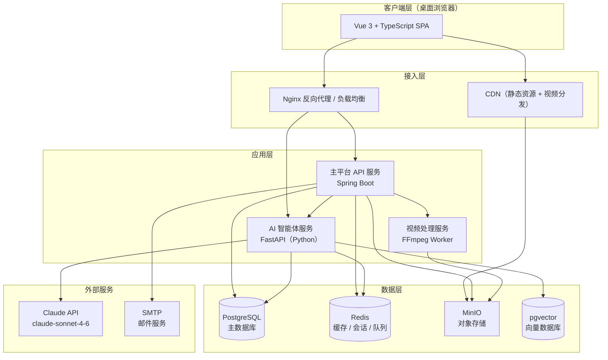

### 1.2 请求分层说明

| 层次 | 职责 |
|------|------|
| 客户端层 | Vue 3 SPA，负责渲染、路由、状态管理 |
| 接入层 | Nginx 处理 HTTPS 终止、负载均衡、限流；CDN 分发静态资源和视频 |
| 应用层 | 主平台 API（业务逻辑）、AI 智能体服务（独立进程）、视频处理 Worker |
| 数据层 | PostgreSQL 持久化、Redis 缓存与消息队列、MinIO 文件存储、pgvector 向量检索 |
| 外部服务 | Claude API（AI 能力）、SMTP（邮件通知） |


---

## 2. 技术选型

### 2.1 前端

| 技术 | 版本 | 用途 |
|------|------|------|
| Vue 3 | 3.4+ | 核心框架，Composition API |
| TypeScript | 5.x | 类型安全 |
| Vite | 5.x | 构建工具 |
| Pinia | 2.x | 状态管理 |
| Vue Router | 4.x | 客户端路由 |
| Axios | 1.x | HTTP 客户端，封装拦截器 |
| Element Plus | 2.x | UI 组件库 |
| ECharts | 5.x | 能力图谱可视化 |
| Video.js | 8.x | 视频播放器，支持 HLS |
| tus-js-client | 4.x | 断点续传协议客户端 |

### 2.2 后端（主平台）

| 技术 | 版本 | 用途 |
|------|------|------|
| Java | 21 LTS | 运行时 |
| Spring Boot | 3.3+ | Web 框架 |
| Spring Security | 6.x | 认证授权 |
| Spring Data JPA | — | ORM |
| jjwt | 0.12+ | JWT 生成与验证 |
| Flyway | — | 数据库版本迁移 |
| Micrometer + Prometheus | — | 指标采集 |

### 2.3 AI 智能体服务

| 技术 | 版本 | 用途 |
|------|------|------|
| Python | 3.12 | 运行时 |
| FastAPI | 0.111+ | 异步 Web 框架 |
| Anthropic SDK | latest | 调用 Claude API |
| Celery + Redis | — | 异步任务队列（批改、标注） |
| pgvector | — | 知识点向量检索 |
| PyMuPDF / python-pptx | — | 文档内容解析 |

### 2.4 数据库与存储

| 技术 | 用途 |
|------|------|
| PostgreSQL 16 | 主数据库，含 pgvector 扩展 |
| Redis 7 | 会话缓存、限流计数器、Celery Broker、通知队列 |
| MinIO | 视频、课件、作业文件对象存储 |

### 2.5 视频处理

| 技术 | 用途 |
|------|------|
| FFmpeg | 视频转码（MP4 → HLS 分片） |
| HLS | 视频流媒体协议，支持自适应码率 |
| Nginx + nginx-vod-module | 视频流服务，配合 CDN |

### 2.6 部署与运维

| 技术 | 用途 |
|------|------|
| Docker + Docker Compose | 容器化（开发/测试环境） |
| Kubernetes | 容器编排，水平扩展（生产环境） |
| Prometheus + Grafana | 监控告警 |
| ELK Stack | 日志收集与检索 |
| GitHub Actions | CI/CD 流水线 |


---

## 3. 数据库设计

### 3.1 核心实体 ER 图

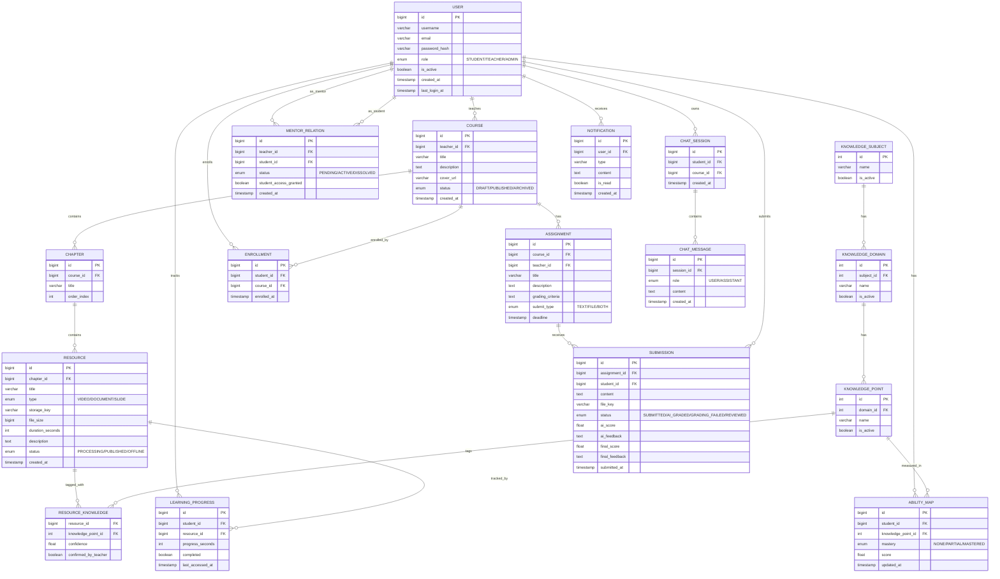

### 3.2 关键约束与索引

| 表 | 约束 / 索引 | 说明 |
|----|------------|------|
| users | UNIQUE(email) | 邮箱唯一 |
| users | INDEX(role, is_active) | 管理员批量查询 |
| resource_knowledge | PK(resource_id, knowledge_point_id) | 联合主键 |
| ability_map | UNIQUE(student_id, knowledge_point_id) | 每人每知识点一条记录 |
| learning_progress | UNIQUE(student_id, resource_id) | 每人每资源一条进度 |
| submissions | INDEX(assignment_id, status) | 批改队列查询 |
| notifications | INDEX(user_id, is_read, created_at) | 未读通知查询 |

### 3.3 关键字段说明

- `resource_knowledge.confirmed_by_teacher = false`：AI 建议标签，待教师确认
- `ability_map.score`：范围 0.0–1.0，由测试引擎写入
- `submission.status` 状态流转：`SUBMITTED` → `AI_GRADED` / `GRADING_FAILED` → `REVIEWED`
- `mentor_relation.student_access_granted`：默认 `true`，学生可随时撤销置 `false`


---

## 4. API 设计规范

### 4.1 基础规范

- 风格：RESTful，资源名称使用复数名词
- 基础路径：`/api/v1/`
- 数据格式：JSON（`Content-Type: application/json`）
- 字符编码：UTF-8
- 时间格式：ISO 8601（`2026-03-20T10:00:00+08:00`）

### 4.2 认证方式

所有需要认证的接口在请求头携带：

```
Authorization: Bearer <JWT Token>
```

JWT Payload 结构：

```json
{
  "sub": "12345",
  "role": "STUDENT",
  "iat": 1742400000,
  "exp": 1742407200
}
```

- 普通会话 Token 有效期：2 小时
- "记住我" Token 有效期：7 天
- Token 刷新：客户端在过期前 5 分钟调用 `POST /api/v1/auth/refresh`

### 4.3 统一响应结构

成功响应：

```json
{
  "code": 0,
  "message": "success",
  "data": { }
}
```

分页响应：

```json
{
  "code": 0,
  "message": "success",
  "data": {
    "items": [ ],
    "total": 100,
    "page": 1,
    "pageSize": 20
  }
}
```

错误响应：

```json
{
  "code": 40301,
  "message": "无权访问该资源",
  "data": null
}
```

### 4.4 错误码规范

| 错误码 | HTTP 状态 | 含义 |
|--------|-----------|------|
| 0 | 200 | 成功 |
| 40001 | 400 | 请求参数错误 |
| 40002 | 400 | 文件格式不支持 |
| 40003 | 400 | 文件大小超限 |
| 40101 | 401 | 未登录或 Token 失效 |
| 40102 | 401 | Token 已过期 |
| 40301 | 403 | 权限不足 |
| 40302 | 403 | 账号已被禁用 |
| 40303 | 403 | 账号已锁定（暴力破解保护） |
| 40401 | 404 | 资源不存在 |
| 40901 | 409 | 数据冲突（如重复选课） |
| 42901 | 429 | 请求频率超限 |
| 50001 | 500 | 服务器内部错误 |
| 50301 | 503 | AI 服务暂时不可用 |

### 4.5 核心 API 端点

**认证模块**

```
POST   /api/v1/auth/login
POST   /api/v1/auth/logout
POST   /api/v1/auth/refresh
POST   /api/v1/auth/password/reset-request
POST   /api/v1/auth/password/reset
```

**课程模块**

```
GET    /api/v1/courses                         # 课程列表（含搜索/筛选）
POST   /api/v1/courses                         # 创建课程（教师）
GET    /api/v1/courses/{id}                    # 课程详情
PUT    /api/v1/courses/{id}                    # 更新课程
GET    /api/v1/courses/{id}/chapters           # 章节列表
POST   /api/v1/courses/{id}/chapters           # 创建章节
POST   /api/v1/chapters/{id}/resources         # 上传资源
GET    /api/v1/resources/{id}/play-url         # 获取视频播放地址（签名 URL）
```

**能力图谱模块**

```
GET    /api/v1/students/{id}/ability-map       # 获取能力图谱
POST   /api/v1/ability-tests                   # 开始测试
GET    /api/v1/ability-tests/{id}/next         # 获取下一题
POST   /api/v1/ability-tests/{id}/answer       # 提交答案
POST   /api/v1/ability-tests/{id}/finish       # 完成测试
```

**学习路线模块**

```
GET    /api/v1/students/{id}/learning-path         # 获取个性化路线
POST   /api/v1/students/{id}/learning-path/refresh # 刷新路线
PATCH  /api/v1/learning-progress                   # 更新学习进度
```

**作业模块**

```
POST   /api/v1/courses/{id}/assignments        # 布置作业（教师）
GET    /api/v1/assignments/{id}                # 作业详情
POST   /api/v1/assignments/{id}/submit         # 提交作业（学生）
GET    /api/v1/assignments/{id}/submissions    # 批改列表（教师）
PATCH  /api/v1/submissions/{id}/review         # 人工复核（教师）
```

**AI 助手模块**

```
POST   /api/v1/chat/sessions                   # 创建会话
POST   /api/v1/chat/sessions/{id}/messages     # 发送消息（SSE 流式响应）
GET    /api/v1/chat/sessions/{id}/messages     # 历史消息
```

**导师关系模块**

```
POST   /api/v1/mentor-relations                # 发起申请
PATCH  /api/v1/mentor-relations/{id}           # 接受/拒绝/解除
GET    /api/v1/students/{id}/profile           # 学生学习档案（导师视角）
POST   /api/v1/mentor-relations/{id}/guidance  # 填写指导意见
```

**文件上传（断点续传，tus 协议）**

```
POST   /api/v1/uploads/init                    # 初始化上传，返回 upload_id
PATCH  /api/v1/uploads/{upload_id}             # 分片上传
HEAD   /api/v1/uploads/{upload_id}             # 查询上传进度
```

**管理员模块**

```
GET    /api/v1/admin/users                     # 用户列表
POST   /api/v1/admin/users/batch-import        # 批量导入账号
PATCH  /api/v1/admin/users/{id}                # 修改角色/状态
GET    /api/v1/admin/knowledge-points          # 知识点分类树
POST   /api/v1/admin/knowledge-points          # 新增知识点
PATCH  /api/v1/admin/knowledge-points/{id}     # 编辑/停用知识点
GET    /api/v1/admin/stats                     # 平台统计数据
```


---

## 5. 核心模块设计

### 5.1 用户认证与权限模块

**登录流程**

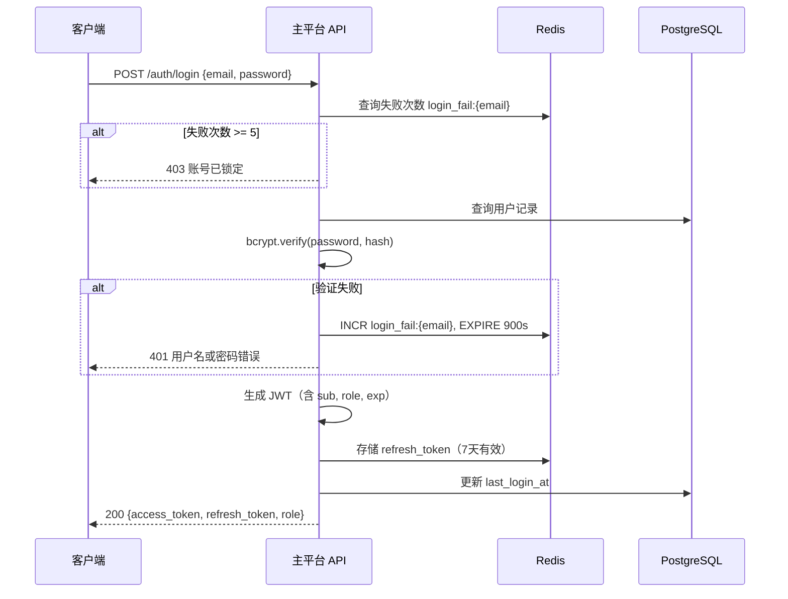

**权限控制**

Spring Security 基于角色的方法级注解：

```java
@PreAuthorize("hasRole('TEACHER')")
@PreAuthorize("hasRole('ADMIN')")
@PreAuthorize("#studentId == authentication.principal.id or hasRole('ADMIN')")
```

课程资源访问额外校验选课状态：拦截器验证 `enrollment` 表中存在对应记录，未选课学生返回 403。

### 5.2 文件上传与存储模块

**断点续传流程（tus 协议）**

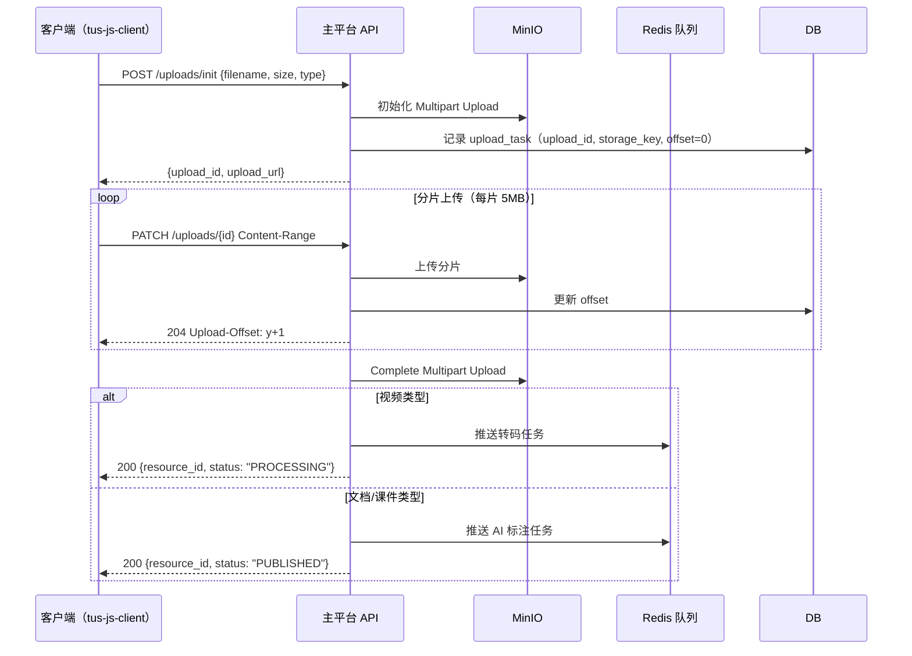

**存储路径规范**

```
videos/{year}/{month}/{resource_id}/original.mp4
videos/{year}/{month}/{resource_id}/hls/index.m3u8
videos/{year}/{month}/{resource_id}/hls/segment_{n}.ts
documents/{year}/{month}/{resource_id}/{filename}
assignments/{year}/{month}/{submission_id}/{filename}
```

MinIO 存储桶设为私有，所有访问通过后端生成预签名 URL（有效期 1 小时），不直接暴露存储地址。

### 5.3 视频处理模块

视频上传完成后，API 向 Redis 队列推送转码任务，VideoService Worker 消费：

1. 从 MinIO 下载原始 MP4
2. FFmpeg 转码为多码率 HLS（360p / 720p / 1080p）
3. 提取音轨生成字幕（VTT 格式，供图谱构建智能体分析）
4. 上传 HLS 分片至 MinIO
5. 更新 `resource.status = PUBLISHED`，通知 API 触发 AI 标注任务

### 5.4 能力图谱测试模块

**自适应测试引擎**

题目表含字段：`knowledge_point_id`、`difficulty`（1–5）、`content`、`options`、`answer`。

自适应算法（简化 IRT）：

- 初始难度：3（中等）
- 答对：下一题难度 +1（上限 5）；答错：下一题难度 -1（下限 1）
- 每个知识点最少 3 题、最多 7 题
- 连续 3 题同难度全对 → 标记"已掌握"；连续 3 题同难度全错 → 标记"未掌握"

测试进度保存在 Redis（`test_session:{test_id}`，TTL 7 天），支持断点继续。

### 5.5 个性化学习路线模块

路线生成由 AI 智能体服务异步处理：

1. 主平台 API 收到路线请求，向 Celery 队列推送任务
2. 个性化导航智能体读取学生 `ability_map`（掌握程度 < MASTERED 的知识点）
3. 在 `resource_knowledge` 表查询覆盖这些知识点的候选资源片段
4. 调用 Claude API 对候选资源排序，生成推荐序列（含推荐理由）
5. 结果写入 `learning_paths` 表，通过 WebSocket 通知客户端刷新

路线缓存在 Redis（`learning_path:{student_id}`，TTL 24 小时），学习进度更新时失效并触发重新生成（防抖 30 分钟）。

### 5.6 作业批改模块

**提交状态机**

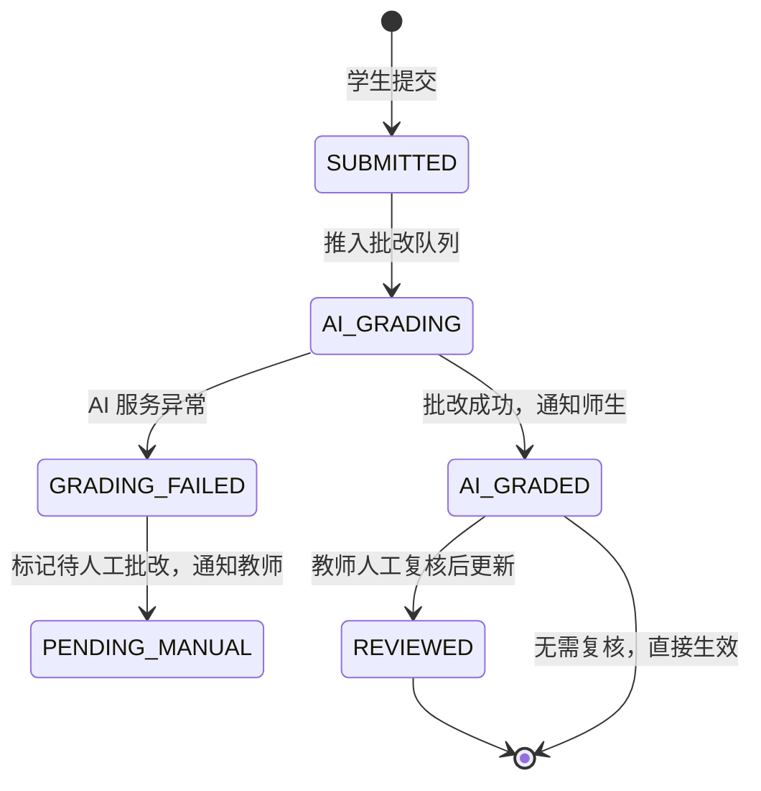

批改任务为 Celery 异步任务，超时设置：简单作业 60s，复杂作业 300s。失败后重试 2 次，仍失败则置 `GRADING_FAILED`，通知教师人工处理。

### 5.7 站内通知模块

- 通知事件由各业务模块发布到 Redis Pub/Sub 频道 `notifications:{user_id}`
- 通知持久化写入 `notifications` 表
- 客户端通过 WebSocket 长连接实时接收推送；连接断开时降级为轮询（30s 间隔）
- 用户离线时，下次登录拉取未读通知列表
- 通知延迟目标 ≤ 5 分钟


---

## 6. AI 智能体集成方案

### 6.1 智能体服务架构

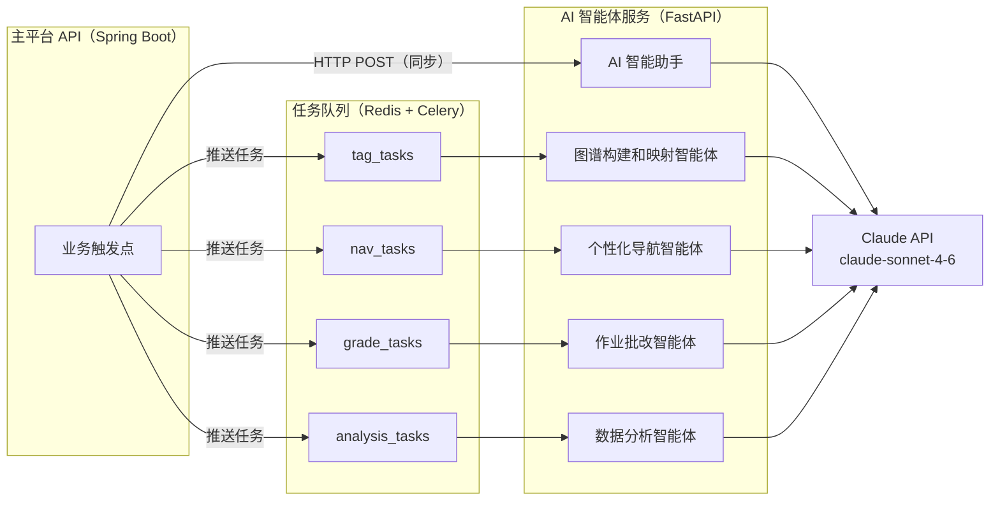

### 6.2 图谱构建和映射智能体

**触发时机**：教师上传资源并保存后，主平台 API 推送任务到 `tag_tasks` 队列。

**数据流**：

```
输入：
  - resource_id、资源类型（VIDEO/DOCUMENT/SLIDE）
  - 文本内容（视频字幕 VTT / 文档提取文本 / 标题+简介降级）
  - 知识点分类树（从 DB 加载，Redis 缓存 1 小时）

处理：
  1. 解析输入文本（PyMuPDF 处理 PDF，python-pptx 处理 PPT）
  2. 构建 Prompt，要求 Claude 从分类树中匹配知识点
  3. Claude 返回 JSON：[{knowledge_point_id, name, confidence}]
  4. 写入 resource_knowledge 表（confirmed_by_teacher=false）

输出：
  - 建议标签列表（含置信度，按置信度降序）
  - 回调主平台 API，通知教师进入确认流程
```

**Prompt 设计要点**：将知识点分类树以结构化 JSON 传入，要求 Claude 仅从给定列表中选择，不允许自由发挥，避免幻觉。降级场景（无字幕、文件无法解析）时在界面提示分析依据有限，建议教师手动补充。

### 6.3 个性化导航智能体

**触发时机**：学生完成能力测试后；学习进度更新后（防抖 30 分钟，避免频繁重算）。

**数据流**：

```
输入：
  - student_id
  - ability_map（各知识点掌握程度，过滤 mastery=MASTERED）
  - 候选资源列表（resource_knowledge 关联查询，含课程/章节信息）

处理：
  1. 筛选掌握程度 < MASTERED 的知识点
  2. 查询覆盖这些知识点的资源片段（含课程信息）
  3. 调用 Claude 对候选资源排序，生成推荐序列
  4. Claude 返回 JSON：[{resource_id, knowledge_point_id, reason, priority}]
  5. 写入 learning_paths 表，更新 Redis 缓存

输出：
  - 有序推荐列表（精确到资源片段，含推荐理由）
  - WebSocket 推送通知客户端刷新
```

**跨课程推荐逻辑**：同一知识点可能有多个课程的资源片段覆盖，Claude 根据资源描述、标题、知识点置信度综合排序，选出最优片段，不限定来源课程。

### 6.4 作业批改智能体

**触发时机**：学生提交作业后，主平台 API 推送任务到 `grade_tasks` 队列。

**数据流**：

```
输入：
  - submission_id
  - 提交内容（文字内容 / 文件从 MinIO 下载后提取文本）
  - 教师设定的评分标准（grading_criteria）

处理：
  1. 解析提交内容（文字直接使用，文件用 PyMuPDF 提取文本）
  2. 构建批改 Prompt，包含评分标准和提交内容
  3. 调用 Claude 生成评分和评语
  4. Claude 返回 JSON：{score, feedback, strengths, weaknesses}
  5. 更新 submission 表（ai_score, ai_feedback, status=AI_GRADED）

输出：
  - 评分 + 详细评语（优点和不足）
  - 通知主平台，触发师生通知
```

**异常处理**：AI 服务异常或内容无法解析时，置 `status=GRADING_FAILED`，通知教师"AI 批改未完成，请人工批改"，不向学生展示任何评分。

### 6.5 AI 智能助手（答疑）

**触发方式**：同步调用，主平台 API 直接转发请求到 AI 智能体服务，使用 SSE（Server-Sent Events）流式返回响应。

**数据流**：

```
输入：
  - session_id（会话 ID，用于多轮对话上下文）
  - 用户消息文本
  - 当前课程上下文（course_id，可选）

处理：
  1. 从 DB 加载历史消息（最近 20 条，控制 Token 用量）
  2. 构建对话 Prompt（含课程上下文）
  3. 调用 Claude API（流式模式）
  4. 实时将 token 通过 SSE 推送给客户端
  5. 完整响应写入 chat_messages 表

输出：
  - 流式文本响应（SSE）
  - 持久化对话历史
```

**上下文管理**：每个会话保留最近 20 条消息，超出时滑动窗口截断最早消息，保留 system prompt 和最新消息。

### 6.6 数据分析智能体

**触发时机**：管理员手动触发（按需生成，不影响系统性能）。

**分析场景**：

| 场景 | 输入数据 | 输出 |
|------|---------|------|
| 账号健康度评估 | 用户登录频率、活跃度、异常登录记录 | 账号健康度报告，标记异常账号 |
| 平台使用分析 | 功能模块访问频率、操作路径、用户行为日志 | 功能接受度分析、隐藏需求挖掘、优化建议 |
| 内容合规预审 | 新上传课程资料文本内容 | 合规风险评估，标记疑似违规内容（召回率 ≥ 90%，误判率 ≤ 5%） |

所有分析结果仅作为辅助参考，最终决策由管理员执行。


---

## 7. 安全设计

### 7.1 传输安全

- 全站强制 HTTPS，Nginx 配置 HTTP → HTTPS 301 重定向
- TLS 版本：TLS 1.2+，禁用 TLS 1.0 / 1.1
- HSTS 响应头：`Strict-Transport-Security: max-age=31536000; includeSubDomains`
- 视频流媒体通过 CDN 分发，同样走 HTTPS

### 7.2 认证与会话安全

- 密码使用 bcrypt 加密存储（cost factor ≥ 12），禁止明文存储
- JWT 使用 RS256 非对称签名，私钥仅主平台 API 持有
- access_token 有效期 2 小时，refresh_token 有效期 7 天，存储于 Redis（支持主动吊销）
- 登录失败 5 次锁定账号 15 分钟，计数器存 Redis，TTL 15 分钟
- 密码重置链接有效期 30 分钟，使用后立即失效（一次性 Token）

### 7.3 访问控制

- 严格基于角色（RBAC）控制接口访问，Spring Security 方法级注解
- 学生只能访问自己的学习数据，跨用户访问返回 403
- 课程资源访问与选课状态绑定，未选课学生无法访问课程内容
- 导师只能访问已建立关系且 `student_access_granted=true` 的学生档案
- 导师视角下屏蔽学生手机号、身份证号、家庭住址等个人身份信息
- 作业原始提交内容不对导师开放，仅展示评分和评语
- MinIO 存储桶设为私有，所有文件访问通过后端签名 URL（有效期 1 小时）

### 7.4 输入验证与防注入

- 所有用户输入在后端进行严格校验（Spring Validation），不信任前端校验
- 数据库操作全部使用 JPA 参数化查询，禁止拼接 SQL，防止 SQL 注入
- 富文本内容（讨论区帖子）使用白名单过滤，防止 XSS
- 所有 API 接口添加 CSRF Token 校验（非 GET 请求）
- 文件上传校验：MIME 类型白名单 + 文件头魔数双重验证，防止文件类型伪造

### 7.5 文件安全

- 上传文件进行病毒扫描（ClamAV 集成），扫描失败则拒绝存储
- 文件名规范化处理，防止路径穿越攻击（`../` 等）
- 视频转码在隔离的 Worker 容器中执行，不影响主平台
- 文件存储路径使用 UUID 命名，不暴露原始文件名

### 7.6 限流与防攻击

| 接口 | 限流规则 |
|------|---------|
| POST /auth/login | 同 IP 每分钟 ≤ 10 次 |
| POST /auth/password/reset-request | 同邮箱每小时 ≤ 3 次 |
| POST /uploads/init | 同用户每分钟 ≤ 5 次 |
| POST /chat/sessions/{id}/messages | 同用户每分钟 ≤ 30 次 |
| 其他 API | 同用户每分钟 ≤ 200 次 |

限流计数器存储于 Redis，使用滑动窗口算法。超限返回 429，响应头包含 `Retry-After`。


---

## 8. 部署架构

### 8.1 环境划分

| 环境 | 用途 | 部署方式 |
|------|------|---------|
| 开发环境 | 本地开发调试 | Docker Compose |
| 测试环境 | 集成测试、QA 验收 | Docker Compose（单机） |
| 生产环境 | 正式对外服务 | Kubernetes 集群 |

### 8.2 Docker Compose 服务清单（开发/测试）

```yaml
services:
  nginx:          # 反向代理，端口 80/443
  frontend:       # Vue 3 SPA，Nginx 静态服务
  api:            # Spring Boot 主平台 API，端口 8080
  ai-service:     # FastAPI AI 智能体服务，端口 8000
  video-worker:   # FFmpeg 视频处理 Worker
  celery-worker:  # Celery 异步任务 Worker
  postgres:       # PostgreSQL 16，端口 5432
  redis:          # Redis 7，端口 6379
  minio:          # MinIO 对象存储，端口 9000/9001
```

### 8.3 生产环境部署图

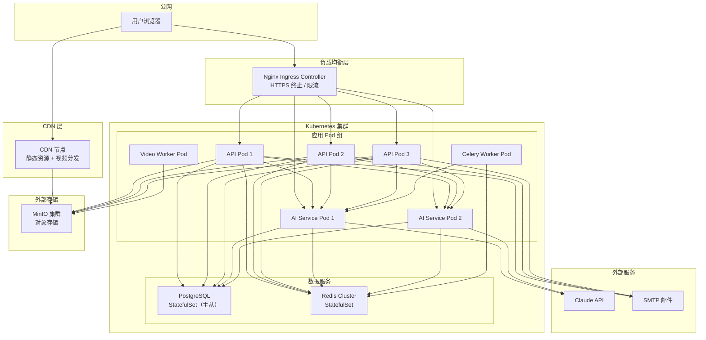

### 8.4 Kubernetes 资源配置

| 服务 | 初始副本数 | 最大副本数 | HPA 触发条件 |
|------|-----------|-----------|-------------|
| api | 2 | 6 | CPU > 70% |
| ai-service | 1 | 4 | CPU > 60% |
| celery-worker | 1 | 4 | 队列积压 > 50 |
| video-worker | 1 | 3 | 队列积压 > 5 |

资源限制（单 Pod）：

| 服务 | CPU Request | CPU Limit | Memory Request | Memory Limit |
|------|------------|-----------|---------------|-------------|
| api | 500m | 2000m | 512Mi | 2Gi |
| ai-service | 500m | 2000m | 512Mi | 2Gi |
| celery-worker | 250m | 1000m | 256Mi | 1Gi |
| video-worker | 1000m | 4000m | 1Gi | 4Gi |

### 8.5 CI/CD 流水线

```mermaid
flowchart LR
    Push["代码推送\n到 main/dev 分支"] --> Lint["代码检查\nCheckstyle / ESLint"]
    Lint --> Test["单元测试\n+ 集成测试"]
    Test --> Build["Docker 镜像构建\n打标签（commit SHA）"]
    Build --> Push2Registry["推送镜像\n到 Container Registry"]
    Push2Registry --> DeployTest["部署到测试环境\nDocker Compose"]
    DeployTest --> E2E["E2E 测试\nPlaywright"]
    E2E --> |"main 分支"| DeployProd["部署到生产环境\nKubernetes 滚动更新"]
    DeployProd --> Notify["通知部署结果\n（Slack / 邮件）"]
```

- 测试环境：每次推送自动触发
- 生产环境：仅 `main` 分支合并后触发，需人工审批
- 回滚：保留最近 3 个镜像版本，`kubectl rollout undo` 一键回滚

### 8.6 监控与告警

**监控指标（Prometheus + Grafana）**

| 指标类型 | 具体指标 |
|---------|---------|
| 系统层 | CPU 使用率、内存使用率、磁盘 I/O、网络流量 |
| 应用层 | API 请求量、响应时间（P50/P95/P99）、错误率 |
| 业务层 | 在线用户数、视频并发流数、AI 任务队列积压量 |
| 数据层 | PostgreSQL 连接数、慢查询数、Redis 命中率 |

**告警规则**

| 告警条件 | 级别 | 响应动作 |
|---------|------|---------|
| API 错误率 > 5%（持续 5 分钟） | P1 | 立即通知值班人员 |
| P99 响应时间 > 5s（持续 5 分钟） | P2 | 通知开发团队 |
| AI 任务队列积压 > 100 | P2 | 自动扩容 Celery Worker |
| 磁盘使用率 > 80% | P2 | 通知运维扩容存储 |
| PostgreSQL 主库不可用 | P1 | 自动切换从库，立即通知 |

**日志收集（ELK Stack）**

- 所有服务日志通过 Filebeat 采集，发送到 Elasticsearch
- 日志保留周期 ≥ 90 天
- Kibana 提供日志检索和可视化面板
- 关键操作日志：用户登录、文件上传、作业提交、AI 调用

### 8.7 数据备份策略

| 数据类型 | 备份方式 | 频率 | 保留周期 |
|---------|---------|------|---------|
| PostgreSQL | pg_dump 全量 + WAL 增量 | 每日全量，实时增量 | 30 天 |
| Redis | RDB 快照 + AOF 持久化 | 每小时 RDB | 7 天 |
| MinIO 文件 | 跨节点冗余存储（纠删码） | 实时冗余 | 永久 |
| 备份文件 | 异地存储（不同可用区） | 随主备份 | 同上 |

恢复目标：RTO ≤ 2 小时，RPO ≤ 24 小时（关键操作数据实时写入，实际丢失窗口远小于 24 小时）。


---

## 9. 关键流程时序图

### 9.1 教师发布资源 → AI 标注 → 图谱构建

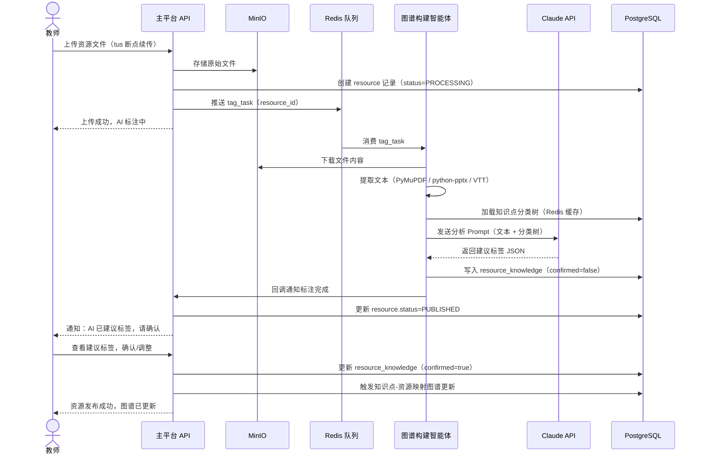

### 9.2 学生学习进度更新 → 路线动态调整

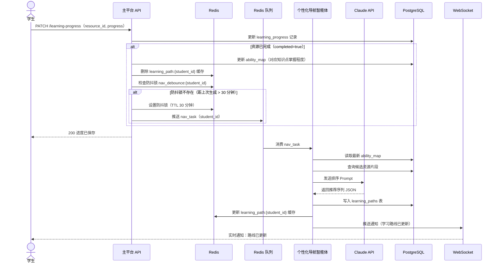

### 9.3 导师-学生关系建立流程

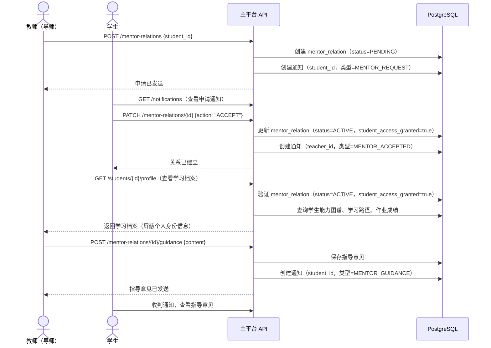


---

## 10. 前端模块设计

### 10.1 路由结构

```
/                          # 重定向至登录页或首页
/login                     # 登录页
/password-reset            # 密码重置

# 学生路由
/student/
  dashboard                # 首页（课程列表 + 学习进度）
  ability-map              # 能力图谱
  ability-test             # 能力图谱测试
  learning-path            # 个性化学习路线
  courses/{id}             # 课程详情
  courses/{id}/chapters/{chapterId}/resources/{resourceId}  # 资源学习页
  assignments              # 作业列表
  assignments/{id}         # 作业详情 + 提交
  chat                     # AI 智能助手
  notifications            # 消息通知
  profile                  # 个人设置

# 教师路由
/teacher/
  dashboard                # 首页（课程管理概览）
  courses                  # 课程列表
  courses/create           # 创建课程
  courses/{id}/edit        # 编辑课程
  courses/{id}/chapters    # 章节管理
  courses/{id}/assignments # 作业管理
  courses/{id}/graph       # 图谱分析报告
  assignments/{id}/submissions  # 批改列表
  students                 # 学生管理（导师关系）
  notifications            # 消息通知

# 管理员路由
/admin/
  dashboard                # 平台统计概览
  users                    # 用户账号管理
  knowledge-points         # 知识点分类体系
  content-review           # 内容审核
  stats                    # 数据统计报告
```

### 10.2 状态管理（Pinia Store）

| Store | 职责 |
|-------|------|
| `useAuthStore` | 用户信息、Token、角色、登录/登出 |
| `useCourseStore` | 课程列表、当前课程详情 |
| `useAbilityStore` | 能力图谱数据、测试状态 |
| `useLearningPathStore` | 个性化学习路线 |
| `useNotificationStore` | 通知列表、未读数量 |
| `useChatStore` | 当前会话消息列表 |

### 10.3 关键组件

| 组件 | 说明 |
|------|------|
| `AbilityMapChart` | ECharts 雷达图，展示各知识点掌握程度 |
| `LearningPathTimeline` | 推荐路线时间轴，支持点击跳转 |
| `VideoPlayer` | Video.js 封装，支持 HLS、断点续播、倍速 |
| `FileUploader` | tus-js-client 封装，支持断点续传、进度展示 |
| `ChatWindow` | SSE 流式消息渲染，支持多轮对话 |
| `KnowledgeTagSelector` | 知识点分类树选择器，支持关键词搜索 |
| `NotificationBell` | 导航栏通知图标，WebSocket 实时更新未读数 |

### 10.4 视频播放页设计要点

- 视频播放器左侧，章节/资源列表右侧（可折叠）
- 播放进度每 10 秒自动上报一次（防抖，避免频繁请求）
- 视频播放完成后自动标记"已完成"，触发能力图谱更新
- AI 智能助手悬浮入口，点击展开侧边对话框，不打断视频播放
- 支持全屏模式，全屏时隐藏侧边栏


---

## 11. 后端模块结构

### 11.1 主平台 API 包结构

```
com.cloudteachingai/
├── config/
│   ├── SecurityConfig.java          # Spring Security 配置
│   ├── JwtConfig.java               # JWT 配置
│   └── RedisConfig.java             # Redis 配置
├── controller/
│   ├── AuthController.java
│   ├── CourseController.java
│   ├── ResourceController.java
│   ├── AbilityTestController.java
│   ├── LearningPathController.java
│   ├── AssignmentController.java
│   ├── ChatController.java
│   ├── MentorController.java
│   ├── NotificationController.java
│   └── AdminController.java
├── service/
│   ├── AuthService.java
│   ├── CourseService.java
│   ├── UploadService.java           # 断点续传逻辑
│   ├── VideoProcessingService.java  # 转码任务推送
│   ├── AbilityTestService.java      # 自适应测试引擎
│   ├── LearningPathService.java     # 路线请求 + 缓存
│   ├── AssignmentService.java
│   ├── NotificationService.java     # 通知发布
│   └── AiAgentClient.java           # AI 智能体服务 HTTP 客户端
├── repository/                      # Spring Data JPA Repositories
├── entity/                          # JPA 实体类
├── dto/                             # 请求/响应 DTO
├── security/
│   ├── JwtAuthFilter.java           # JWT 认证过滤器
│   └── UserDetailsServiceImpl.java
├── exception/
│   ├── GlobalExceptionHandler.java  # 统一异常处理
│   └── BusinessException.java
└── util/
    ├── MinioUtil.java               # 预签名 URL 生成
    └── RateLimiter.java             # Redis 滑动窗口限流
```

### 11.2 AI 智能体服务目录结构

```
ai_service/
├── main.py                          # FastAPI 入口
├── routers/
│   ├── chat.py                      # AI 助手（同步 SSE）
│   └── callback.py                  # 主平台回调接口
├── agents/
│   ├── tag_agent.py                 # 图谱构建和映射智能体
│   ├── nav_agent.py                 # 个性化导航智能体
│   ├── grade_agent.py               # 作业批改智能体
│   ├── chat_agent.py                # AI 智能助手
│   └── analysis_agent.py            # 数据分析智能体
├── tasks/
│   ├── celery_app.py                # Celery 配置
│   ├── tag_tasks.py                 # 标注异步任务
│   ├── nav_tasks.py                 # 路线生成异步任务
│   ├── grade_tasks.py               # 批改异步任务
│   └── analysis_tasks.py            # 分析异步任务
├── parsers/
│   ├── pdf_parser.py                # PyMuPDF 文档解析
│   ├── pptx_parser.py               # python-pptx 解析
│   └── vtt_parser.py                # 视频字幕解析
├── db/
│   ├── session.py                   # SQLAlchemy 会话
│   └── models.py                    # ORM 模型（只读查询用）
└── utils/
    ├── claude_client.py             # Anthropic SDK 封装
    └── prompt_builder.py            # Prompt 模板管理
```

---

## 12. 非功能性需求对应方案

### 12.1 性能目标达成方案

| 性能目标 | 实现方案 |
|---------|---------|
| 页面加载 ≤ 2s | CDN 分发静态资源；Vite 代码分割；关键资源预加载 |
| 视频首帧 ≤ 3s | HLS 分片 + CDN 边缘节点；首片优先加载（2s 分片） |
| AI 助手首次响应 ≤ 3s | SSE 流式输出，首 token 即开始渲染，无需等待完整响应 |
| 学习路线生成 ≤ 5s | Redis 缓存路线结果（TTL 24h）；异步预生成（进度更新后后台刷新） |
| 作业提交确认 ≤ 1s | 同步写入 DB 后立即返回，批改任务异步处理 |
| 500 并发用户 | API 服务水平扩展（3 副本起）；Redis 连接池；PostgreSQL 连接池（HikariCP） |
| 200 路视频并发 | HLS 分片由 CDN 承载，不经过应用服务器 |

### 12.2 可用性保障方案

| 目标 | 实现方案 |
|------|---------|
| 年可用性 ≥ 99.5% | K8s 多副本部署；PostgreSQL 主从复制；Redis Cluster |
| RTO ≤ 2h | K8s 自动重启故障 Pod；数据库主从自动切换 |
| 视频播放中断自动重连 | Video.js 内置重连机制；HLS 分片独立，单片失败不影响整体 |
| 不停机更新 | K8s 滚动更新策略（maxUnavailable=0，maxSurge=1） |

### 12.3 扩展性方案

- **水平扩展**：API 服务和 AI 服务均为无状态设计，会话存 Redis，可随时增加副本
- **AI 智能体解耦**：AI 服务独立部署，通过 HTTP + 消息队列与主平台通信，可独立扩展
- **存储扩展**：MinIO 支持分布式集群，按需扩容节点；PostgreSQL 支持读写分离，读请求分发到从库
- **新智能体接入**：在 AI 服务中新增 agent 模块和 Celery 任务，主平台 API 新增触发点，不影响现有功能


---

*功能性需求详见 FRD-CloudTeachingAI.md，非功能性需求详见 NFR-CloudTeachingAI.md*
