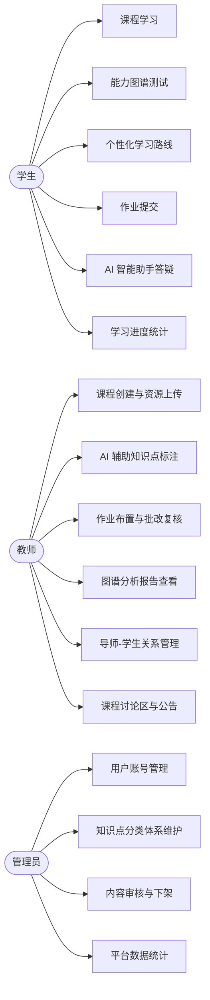
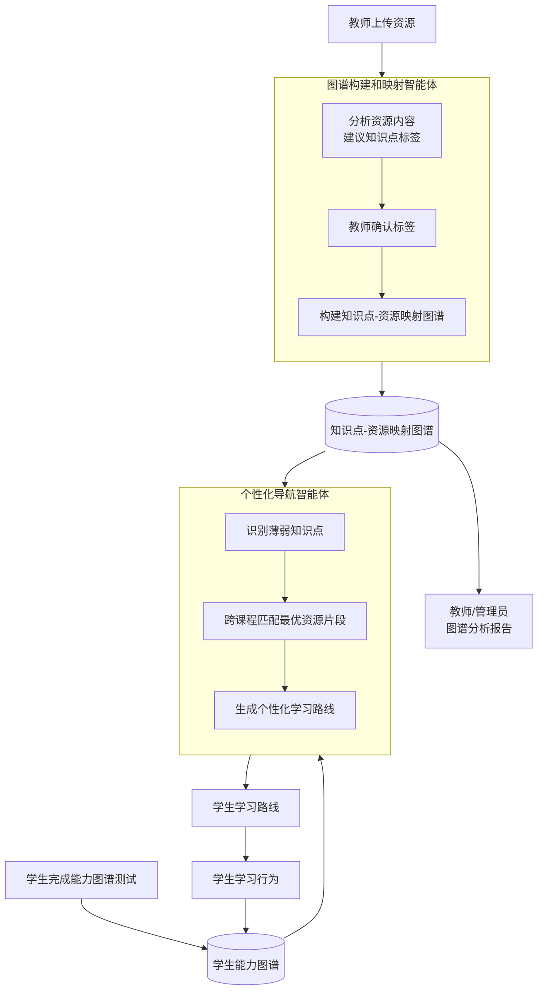
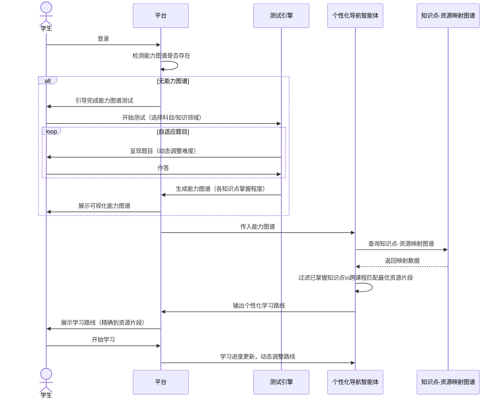
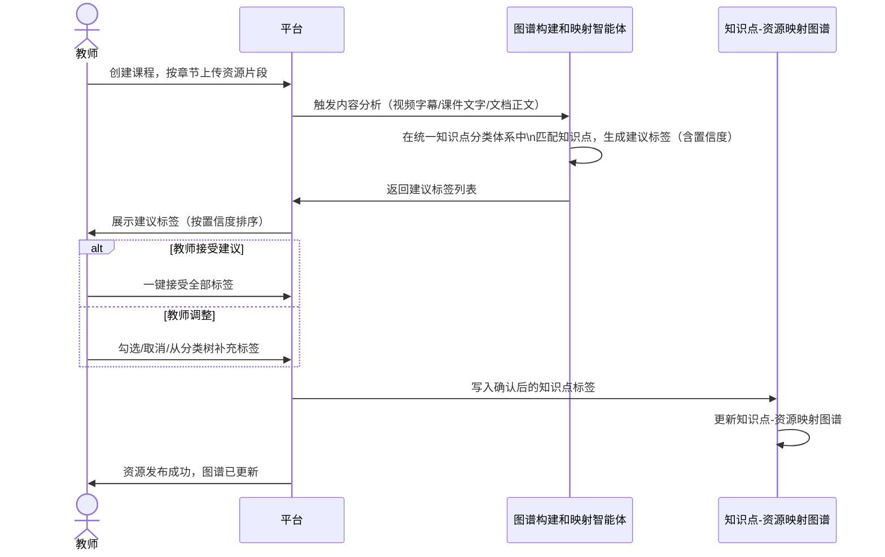
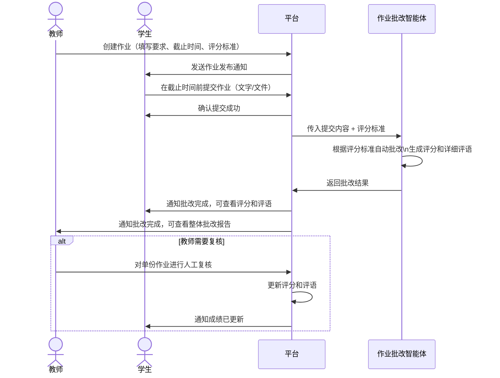

# CloudTeachingAI 功能性需求文档（FRD）

**文档版本**：v1.2
**创建日期**：2026-03-14
**最后更新**：2026-03-16
**关联文档**：URD-CloudTeachingAI.md v2.4

---

## 0. 系统概览

### 0.1 角色与功能权限

### 0.2 智能体数据流

### 0.3 能力测试 → 路线生成流程

### 0.4 教师发布资源 → AI 标注 → 图谱构建流程

### 0.5 作业提交 → AI 批改 → 通知流程

---

## 1. 用户认证与权限管理

### 1.1 用户登录

**优先级**：P0

| 项目 | 描述 |
|------|------|
| 输入 | 用户名/邮箱 + 密码 |
| 处理 | 验证凭据，生成会话 Token，记录登录时间 |
| 输出 | 跳转至对应角色首页（学生/教师/管理员） |

**功能细节**：
- 支持学生、教师、管理员三种角色登录
- 登录失败超过 5 次锁定账号 15 分钟
- 支持"记住我"功能，Token 有效期 7 天
- 支持学生和教师通过注册邮箱自助找回密码（发送重置链接，链接有效期 30 分钟）；管理员账号密码仅支持由其他管理员重置

### 1.2 角色权限控制

**优先级**：P0

| 角色 | 可访问功能 |
|------|-----------|
| 学生 | 课程学习、作业提交、AI 问答、学习进度查看、能力图谱 |
| 教师 | 课程管理、作业管理、图谱分析、导师关系、学生管理 |
| 管理员 | 用户管理、内容审核、数据统计、系统配置 |

### 1.3 账号管理（管理员）

**优先级**：P0

- 支持单个创建和批量导入（CSV/Excel 格式）用户账号
- 支持分配和修改用户角色
- 支持禁用/启用账号
- 支持重置用户密码
- AI 自动分析账号数据（活跃度、登录频率、异常账号等），生成账号健康度评估报告，供管理员参考

---

## 2. 课程资源管理

### 2.1 课程创建与发布（教师）

**优先级**：P0

| 项目 | 描述 |
|------|------|
| 输入 | 课程名称、描述、封面图、可见范围（指定班级/学生） |
| 处理 | 创建课程记录，设置访问权限 |
| 输出 | 课程创建成功，可进入章节管理 |

### 2.2 章节与资源上传（教师）

**优先级**：P0

- 支持按章节组织课程内容
- 支持上传格式：视频（MP4）、课件（PDF、PPT、PPTX）、文档（DOC、DOCX、PDF）
- 每个资源片段需填写：标题、知识点标签、简介
  - 知识点标签从平台统一知识点分类体系中选择（见 2.5 节），不支持完全自由输入
  - 资源上传后，AI 自动分析内容并建议匹配的知识点标签，教师通过 AI 辅助引导流程（见 10.1 节）完成确认，无需从零手动填写
- 支持对已上传资源进行编辑和删除
- 支持设置资源片段的学习顺序
- 资源上传成功后若 AI 标注服务异常，资源仍可正常发布；平台提示教师"AI 标注暂时不可用，请手动填写知识点标签"，教师可从分类树中手动选择标签后发布

### 2.3 公共课程资源库

**优先级**：P1

- 平台维护公共课程资源库，学生可自主搜索和访问
- 管理员负责公共资源的审核和上架
- 公共资源同样使用统一知识点分类体系打标签，AI 辅助建议标签，管理员审核确认

### 2.4 知识点分类体系管理（管理员）

**优先级**：P0

| 项目 | 描述 |
|------|------|
| 输入 | 管理员维护的知识点分类树（学科 → 知识领域 → 知识点） |
| 处理 | 平台以此为标准，统一规范所有资源的知识点标签 |
| 输出 | 全平台共用的知识点分类体系，供教师打标签、AI 分析、图谱构建使用 |

- 知识点分类树采用三级结构：学科 → 知识领域 → 知识点
- 管理员可新增、编辑、停用知识点节点；停用节点不影响已有标签，但不再出现在选择列表中
- 教师打标签时从分类树中选择，支持关键词搜索快速定位
- 若教师认为现有分类不足，可提交新增知识点申请，由管理员审核后上线

### 2.5 课程搜索

**优先级**：P1

- 学生可通过关键词搜索课程和资源片段
- 支持按知识点标签筛选
- 搜索结果展示课程名称、章节、资源片段标题

---

## 3. 课程学习（学生）

### 3.1 课程列表与进度

**优先级**：P0

- 学生首页展示已选课程列表及各课程学习进度百分比
- 支持按课程进入章节列表，查看各章节完成状态

### 3.2 视频播放

**优先级**：P0

| 项目 | 描述 |
|------|------|
| 输入 | 学生点击视频资源 |
| 处理 | 加载视频，记录播放进度 |
| 输出 | 视频播放，进度自动保存，下次从断点继续 |

- 支持播放进度自动保存，断点续播
- 视频播放完成后标记该资源片段为"已学习"
- 支持调整播放速度（0.75x、1x、1.25x、1.5x、2x）

### 3.3 资料下载

**优先级**：P0

- 学生可下载课程资料（PDF、课件等）
- 下载记录计入学习行为数据

---

## 4. 能力图谱

### 4.1 能力图谱测试

**优先级**：P0

| 项目 | 描述 |
|------|------|
| 输入 | 学生选择测试科目/知识领域 |
| 处理 | 呈现自适应测试题目，根据答题情况动态调整难度 |
| 输出 | 生成能力图谱，标注各知识点掌握程度（未掌握/部分掌握/已掌握） |

- 首次登录且无能力图谱的学生，平台引导优先完成测试
- 测试完成后可查看可视化能力图谱
- 学生可随时重新测试以更新能力图谱
- 测试中途退出时，已作答进度自动保存；下次进入测试时提示是否从断点继续或重新开始；若选择重新开始，已保存进度清除

### 4.2 能力图谱展示

**优先级**：P0

- 以可视化方式展示学生各知识点的掌握程度
- 支持按课程/知识领域筛选查看
- 学习进度变化后，能力图谱随之动态更新

---

## 5. 个性化学习路线（个性化导航智能体）

### 5.1 学习路线生成

**优先级**：P0

| 项目 | 描述 |
|------|------|
| 输入 | 学生能力图谱、图谱构建智能体输出的知识点-资源映射图谱（见 10.2 节） |
| 处理 | 智能体基于映射图谱分析学生薄弱知识点，跨课程匹配最优资源片段，生成个性化推荐序列 |
| 输出 | 个性化学习路线，精确到每个知识点推荐哪门课程的哪个资源片段 |

**推荐逻辑**：
- 已掌握的知识点对应资源片段不推荐
- 同一知识点可跨课程推荐最优片段（如：讲解推荐课程A第2节，习题推荐课程C练习集）
- 路线随学习进度动态更新

### 5.2 学习路线展示

**优先级**：P0

- 以列表或路径图方式展示推荐的资源片段序列
- 每条推荐项显示：知识点、来源课程、资源片段标题、推荐理由
- 学生可点击直接跳转至对应资源片段学习

### 5.3 双模式学习

**优先级**：P0

- 学生可在"推荐路径"和"自主搜索"两种模式间自由切换
- 自主搜索模式下，学生可通过关键词或知识点标签搜索资源
- 两种模式下的学习行为均计入学习进度和能力图谱更新

---

## 6. 作业管理

### 6.1 作业布置（教师）

**优先级**：P0

| 项目 | 描述 |
|------|------|
| 输入 | 作业标题、要求描述、截止时间、评分标准、提交形式 |
| 处理 | 创建作业记录，关联到对应课程，通知选课学生 |
| 输出 | 作业发布成功，学生收到通知 |

- 支持提交形式：文字输入、文件上传（PDF、DOC、DOCX、ZIP）
- 支持设置评分标准（供 AI 批改参考）

### 6.2 作业提交（学生）

**优先级**：P0

- 学生在截止时间前可提交和重新提交作业
- 提交成功后立即收到确认通知
- 截止后不可再提交，显示"已截止"状态

### 6.3 AI 自动批改（作业批改智能体）

**优先级**：P0

| 项目 | 描述 |
|------|------|
| 输入 | 学生提交内容、教师设定的评分标准 |
| 处理 | AI 智能体根据评分标准自动批改，生成评分和评语 |
| 输出 | 评分结果 + 详细评语（指出优点和不足），同时通知学生和教师 |

- 批改完成后学生和教师同时收到通知
- 教师可查看整体批改报告（分数分布、常见问题等）
- 教师可对单份作业进行人工复核，修改评分和评语
- AI 批改失败时（如服务异常、内容无法解析），平台通知教师"AI 批改未完成，请人工批改"，该作业标记为"待人工批改"状态，不向学生展示任何评分

---

## 7. AI 智能助手（答疑）

### 7.1 即时问答

**优先级**：P0

| 项目 | 描述 |
|------|------|
| 输入 | 学生输入问题文本 |
| 处理 | AI 智能助手理解问题，结合课程上下文生成解答 |
| 输出 | 解答文本，支持追问 |

- 问答入口在学习页面和独立问答页均可访问
- 支持多轮对话（追问）
- 对话历史在当前会话内保留

### 7.2 转至讨论区

**优先级**：P1

- 学生对 AI 解答不满意时，可一键将问题转发至课程讨论区
- 教师收到讨论区提问通知
- 教师回复后学生收到通知

---

## 8. 师生互动

### 8.1 课程讨论区

**优先级**：P1

- 每门课程有独立讨论区
- 学生可发帖提问，教师可回复
- 支持楼中楼回复
- 教师发帖时可标记为"公告"，学生收到通知

### 8.2 课程公告

**优先级**：P1

- 教师可在课程内发布公告
- 选课学生收到站内通知

### 8.3 站内消息通知

**优先级**：P0

- 触发通知的事件：作业发布、作业批改完成、教师回复、公告发布、导师关系申请/确认、导师指导意见
- 通知在平台内以消息中心形式展示
- 未读通知数量在导航栏显示

---

## 9. 导师-学生关系

### 9.1 关系建立

**优先级**：P0

| 项目 | 描述 |
|------|------|
| 输入 | 教师发起申请（或学生主动申请），对方确认 |
| 处理 | 双方均同意后正式建立关系，记录关系建立时间 |
| 输出 | 关系建立成功，导师可访问学生完整学习档案 |

- 一位学生可有多位导师，一位教师可指导多位学生
- 任一方可申请解除关系

### 9.2 学生学习档案（导师视角）

**优先级**：P0

- 导师可查看：学生能力图谱、学习路径历史、作业成绩记录
  - 不可见字段：学生手机号、身份证号、家庭住址等个人身份信息
  - 作业内容仅展示评分和评语，原始提交内容不对导师开放
- 导师可在档案页填写个性化指导意见
- 学生收到指导意见通知，可在档案页查看
- 学生可随时在个人设置中撤销导师的档案访问权限，撤销后导师立即失去访问资格

---

## 10. 图谱构建与分析（图谱构建和映射智能体）

### 10.1 AI 辅助知识点标注

**优先级**：P0

| 项目 | 描述 |
|------|------|
| 输入 | 教师上传的资源片段内容（视频字幕/文本、课件文字、文档正文） |
| 处理 | AI 分析资源内容，在统一知识点分类体系中匹配最相关的知识点，生成建议标签列表（含置信度） |
| 输出 | 建议标签列表呈现给教师，教师一键接受或手动调整后确认 |

- AI 建议标签仅作为辅助，最终标签由教师确认，不自动写入
- 建议标签按置信度排序，教师可勾选接受、取消勾选排除、或从分类树中补充添加
- 视频资源优先使用字幕/转写文本进行分析；无字幕时降级为基于标题和简介分析，并在界面提示分析依据有限
- 文档/课件资源（PDF、PPT、DOC 等）若内容无法解析（如加密文件、扫描件图片），降级为基于标题和简介分析，并在界面提示"内容解析受限，建议手动补充标签"
- 标注完成后，该资源片段的知识点标签即时生效，纳入图谱构建数据源

### 10.2 课程资源知识点图谱

**优先级**：P1

| 项目 | 描述 |
|------|------|
| 输入 | 平台所有课程资源（含经教师确认的知识点标签，基于统一分类体系） |
| 处理 | 智能体基于标准化标签分析各资源片段的知识点覆盖，构建知识点-资源映射图谱 |
| 输出 | 可视化图谱，展示各课程资源的知识点侧重与互补关系 |

- 教师和管理员可查看图谱分析报告
- 图谱随新资源上传并完成标注后自动更新
- 因标签基于统一分类体系，图谱可准确识别跨课程的知识点重叠与互补关系
- 该映射图谱作为个性化导航智能体（见 5.1 节）的输入数据源，支持跨课程资源推荐

---

## 11. 学习数据统计

### 11.1 学生个人统计

**优先级**：P1

- 展示：累计学习时长、已完成课程数、作业完成率、平均成绩
- 支持按时间段筛选

### 11.2 课程整体统计（教师）

**优先级**：P1

- 展示：选课人数、平均学习进度、作业提交率、平均成绩分布
- 教师可查看所管理课程的整体学习情况

### 11.3 平台整体统计（管理员）

**优先级**：P1

- 展示：活跃用户数、课程总数、资源总量、整体学习时长
- 支持数据导出
- 记录用户操作行为数据，AI 智能体分析各功能模块的使用频率与接受度
- 智能体基于使用数据挖掘隐藏需求，输出平台整体数据分析报告与优化建议

---

## 12. 内容审核（管理员）

**优先级**：P1

- 管理员可查看所有课程和资源列表
- 支持对违规或低质量内容进行下架处理
- 下架后教师收到通知，学生无法访问该资源
- AI 对新上传的课程资料进行预审，针对内容合规性进行风险评估，标记疑似违规内容供管理员优先审核
- AI 预审结果仅作为辅助参考，最终下架决定由管理员执行

---

*非功能性需求详见 NFR-CloudTeachingAI.md*
