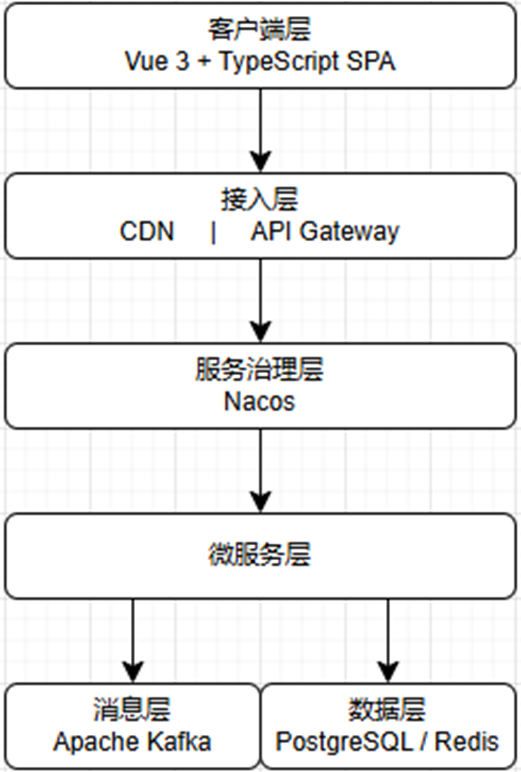

# CloudTeachingAI教育平台系统设计
小组成员：XXX
时间：2026/3/23

# 目录

## 1 系统架构与技术选型

## 2 模块划分与设计

## 3 部署与运维方案

## 4 下一步计划

# 1 系统架构与技术选型

## 系统架构总览

### 层次

- 客户端层：渲染、路由、状态管理
- 接入层：HTTPS终止、JWT验证、路由转发
- 服务治理层：发现、管理服务
- 微服务层：多个业务服务+AI智能体
- 消息层：微服务间异步解耦，事件投递
- 数据层：按服务边界独立数据库，共享Redis

### 技术栈

- 前端：Vue 3 + TypeScript + Vite + Element Plus + Echarts+ Pinia + Video.js + tus-js-client
- 后端：(Java 21 + Spring Boot 3.3 + Spring Cloud)(Python 3.12 + FastAPI + OpenAI SDK)
- 基础设施：(PostgreSQL 16 + Redis 7)(Apache Kafka 3.7)(Nacos + Kubernetes)

# 2 模块划分与设计

## 模块划分

业务微服务：
- Auth-service：注册登录、JWT验证
- User-service：个人信息管理、用户关系维护
- Course-service：课程资源管理、知识点分类
- Learn-service：学习路径与进度管理、能力图谱管理
- Assign-service：作业与习题管理、批改
- Notify-service：站内通知、邮件服务
- Media-service：文件与多媒体服务

智能体服务：
- Tag-agent：课程资源分析智能体
- Nav-agent：个性化导航智能体
- Grade-agent：习题评分智能体
- Chat-agent：AI智能助手
- Analysis-agent：数据分析智能体

## 数字孪生

孪生实体：
- StudentLearningTwin：学生行为孪生，体现学生能力、表现、活跃度等
- CourseContentTwin：课程内容孪生，体现课程资源结构、知识覆盖、参与度、质量指标等
- TeachingEffectivenessTwin：教学效果孪生，体现教师教学水平、知识点规划、学生指导能力等
- SystemRuntimeTwin：系统维护孪生，体现平台服务健康、改进方向等

微服务集群+数字孪生构成平台整体业务功能流程，核心能力从数据分析更进一步至仿真推演

# 3 部署与运维方案

## 环境规划

| 环境 | 环境用途 |
|------|-----------|
| 开发环境 | 本地开发环境 |
| 测试环境 | 集成测试+QA验收 |

| 监控 | 工具 | 范围 |
|------|-----------|---------|
| 指标监控 | Prometheus + Grafana | CPU/内存、API延迟、错误率 |
| 日志聚合 | ELK Stack | 服务日志 |

# 4 下一步计划

## 已完成内容

- 微服务分布式架构：5 层架构（客户端→接入→服务层→消息→数据）
- 服务划分：7 个业务微服务 + 5 个 AI 智能体服务
- 技术栈选型：Vue 3 / Java 21 + Spring Boot 3.3 / Python 3.12 + FastAPI

- API Gateway：路由转发、JWT 鉴权、限流熔断
- 消息总线：Kafka 事件驱动，服务异步解耦
- 数据层：按服务边界独立数据库，Redis 缓存共享

- AI智能体设计：覆盖资源分析、图谱生成、习题批改、AI答疑
- 数字孪生设计：覆盖学生行为、课程内容、教学效果、系统运行

## 下一步阶段工作

- 代码生成：利用 AI 辅助生成 API 接口、实体类、Service 层代码

# 汇报结束
用户需求分析：XXX
功能性需求分析：XXX
非功能性需求分析：XXX
PPT制作：XXX
汇报人：XXX